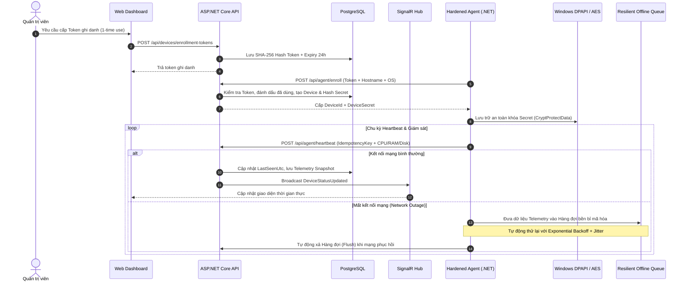
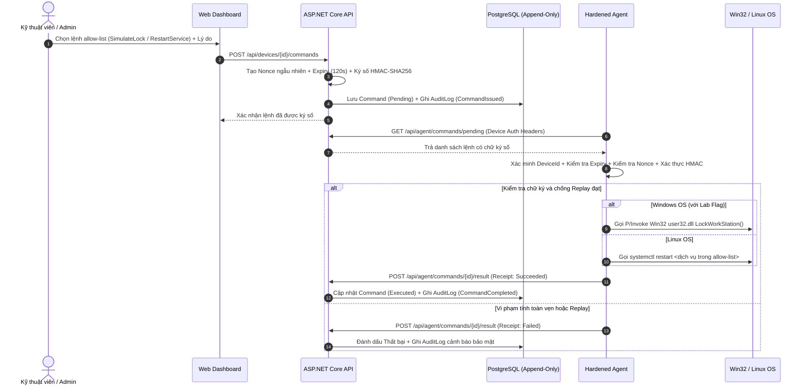
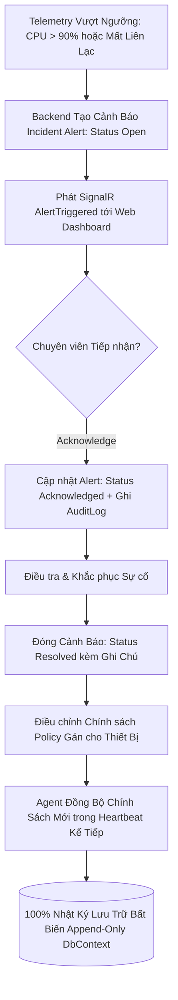

# TỔNG QUAN HỆ THỐNG SENTINELLAN — PART 6 (PROJECT OVERVIEW - PART 6)

> **SentinelLAN** — *Part 6: Endpoint Management, Monitoring and Protection System for Local Area Networks (Full 6-Week Release)*  
> *Hệ thống Quản lý, Giám sát và Bảo vệ Thiết bị Đầu cuối trong Mạng Nội bộ — Giai đoạn Part 6 Hoàn thiện Toàn diện*

---

## 1. GIỚI THIỆU DỰ ÁN (PROJECT INTRODUCTION)

### 1.1. Bối cảnh và Tính cấp thiết
Trong các cơ quan, tổ chức giáo dục (trường đại học, phòng máy thực hành) và doanh nghiệp vừa và nhỏ (SMB), việc quản lý số lượng lớn máy trạm (workstation/PC) và máy chủ nội bộ trong mạng LAN thường gặp nhiều thách thức:
- **Thiếu khả năng giám sát tập trung**: Khó nắm bắt kịp thời tình trạng phần cứng, tài nguyên CPU/RAM/ổ đĩa, và trạng thái online/offline của từng máy.
- **Rủi ro an ninh mạng nội bộ**: Khó kiểm soát việc cài đặt, cấu hình không tuân thủ chính sách bảo mật; thiếu cơ chế phản ứng nhanh khi có sự cố.
- **Xung đột giữa giám sát và quyền riêng tư**: Nhiều giải pháp Endpoint Management trên thị trường có xu hướng can thiệp sâu (chụp màn hình, keylogging, đọc lén tệp tin), gây tâm lý lo ngại cho nhân viên và vi phạm quy chuẩn đạo đức dữ liệu.

**SentinelLAN** được phát triển nhằm giải quyết triệt để bài toán trên bằng cách cung cấp một nền tảng quản trị thiết bị mạng nội bộ tập trung, tin cậy, chi phí tối ưu và đặt yếu tố minh bạch, đạo đức công nghệ lên hàng đầu.

### 1.2. Triết lý Thiết kế Cốt lõi
Hệ thống tuân thủ nghiêm ngặt 4 nguyên tắc kiến trúc:
1. **Tối thiểu quyền (Least Privilege)**: Agent chạy ở tầng người dùng tiêu chuẩn (standard user privileges), không đòi hỏi quyền can thiệp hệ thống sâu vượt quá phạm vi cần thiết.
2. **Minh bạch thông tin (Employee Transparency)**: Cung cấp giao diện riêng (`/my-device`) để nhân viên biết chính xác hệ thống đang thu thập những thông số kỹ thuật nào. Nghiêm cấm mọi hình thức gián điệp ngầm (không keylogger, không chụp màn hình, không đọc dữ liệu cá nhân).
3. **Danh sách trắng có kiểm soát (Strict Allow-list Execution)**: Không cho phép chạy shell tùy ý (arbitrary shell) hoặc script tự do từ xa. Mọi lệnh điều khiển đều nằm trong danh mục định sẵn, được ký số HMAC-SHA256, gắn Nonce chống tấn công phát lại (Replay Attack) và yêu cầu lý do kiểm toán bắt buộc.
4. **Kiểm toán bất biến (Immutable Audit Trail)**: Mọi thao tác quản trị, đăng nhập, ban hành lệnh và xử lý cảnh báo đều được ghi nhận vào nhật ký kiểm toán dạng append-only, không thể chỉnh sửa hay xóa bỏ.

---

## 2. MỤC TIÊU DỰ ÁN (PROJECT OBJECTIVES & GOALS)

### 2.1. Mục tiêu Chức năng (Functional Goals)
- **Quản lý Vòng đời Thiết bị (Device Lifecycle Management)**:
  - Cung cấp cơ chế đăng ký thiết bị (Enrollment) an toàn thông qua One-Time Token.
  - Cấp phát định danh (`DeviceId`) và khóa bảo mật riêng (`DeviceSecret`) cho từng Agent.
  - Giám sát trạng thái nhịp tim (Heartbeat) và tự động nhận diện online/offline theo thời gian thực.
- **Thu thập Telemetry Kỹ thuật (Technical Telemetry Collection)**:
  - Tự động lấy mẫu mức độ tiêu thụ CPU, RAM, dung lượng lưu trữ ổ đĩa, phiên bản hệ điều hành và phiên bản Agent định kỳ.
- **Quản lý Chính sách Bảo mật (Policy Management)**:
  - Định nghĩa các bộ chính sách (ví dụ: chu kỳ heartbeat, ngưỡng cảnh báo tài nguyên, cấm cổng USB, giới hạn mạng).
  - Phân bổ chính sách linh hoạt cho từng thiết bị hoặc nhóm thiết bị trong cùng tổ chức (Tenant).
- **Thực thi Lệnh Điều khiển An toàn (Cryptographic Command Execution)**:
  - Cho phép quản trị viên ban hành các lệnh nghiệp vụ có kiểm soát: `ShowNotification`, `SimulateLock` / `LockWorkStation` (với cờ lab), `SimulateNetworkIsolation`, `RestartService`.
  - Cơ chế nhận lệnh Idempotent và gửi báo cáo kết quả thực thi về máy chủ trung tâm.
- **Hệ thống Cảnh báo Sự cố (Incident Alert System)**:
  - Tự động phát hiện và cảnh báo các dấu hiệu bất thường (thiết bị mất kết nối, quá tải tài nguyên, phát hiện replay attack).
  - Quy trình quản lý vòng đời cảnh báo: `Open` (mới phát hiện) $\rightarrow$ `Acknowledged` (đã tiếp nhận) $\rightarrow$ `Resolved` (đã xử lý).
- **Nhật ký Kiểm toán (Audit Logging)**:
  - Ghi nhận chi tiết: Ai làm gì (Actor), trên thiết bị nào (Device), hành động gì (Action), thời điểm (UTC Timestamp) và kết quả (Success/Failed).
- **Phân quyền Đa người dùng & Đa tổ chức (RBAC & Multi-tenancy)**:
  - Phân quyền theo 3 vai trò chính: **Admin** (toàn quyền quản trị), **Technician** (vận hành kỹ thuật & xử lý sự cố), **Employee** (chỉ xem thiết bị của mình).
  - Cô lập tuyệt đối dữ liệu giữa các tổ chức thông qua định danh `OrganizationId`.

### 2.2. Mục tiêu Phi chức năng & An ninh (Non-Functional & Security Goals)
- **Bảo mật Cấp doanh nghiệp**:
  - Cơ chế xác thực cookie phiên `HttpOnly`, `SameSite=Strict`, xoay vòng Refresh Token (Token Family) và tự động thu hồi khi nghi ngờ tái sử dụng token cũ.
  - Bảo vệ chống tấn công CSRF qua header `X-SentinelLAN-CSRF`.
  - Xác thực lệnh cho Agent bằng mã băm bảo mật HMAC-SHA256 với Secret riêng của thiết bị.
  - Mã hóa bảo vệ danh tính thiết bị bằng Windows DPAPI (`crypt32.dll`) và chuẩn mật mã AES-256 trên Linux.
- **Hiệu năng và Thời gian thực**:
  - Giao thức WebSocket/SignalR giúp đẩy trạng thái thiết bị và cập nhật số liệu tức thì lên Web Dashboard mà không cần polling liên tục từ trình duyệt.
- **Khả năng Mở rộng & Tương thích**:
  - Agent hỗ trợ chạy đa nền tảng (Cross-platform) trên Windows (dưới dạng Windows Service / Background Process) và Linux VPS (quản lý qua `systemctl`).
- **Trải nghiệm Người dùng (UX/UI)**:
  - Giao diện trực quan, bảng điều khiển hiện đại, hỗ trợ chuyển đổi song ngữ tức thì **Tiếng Việt — Tiếng Anh (i18n)**.

### 2.3. Hiện trạng Tiến độ & Các Cột mốc (Đánh giá Thực tế ~40%, Đang hướng tới 50% Giữa kỳ)
- [x] **Tuần 1 (Nền tảng & Auth)**: Hoàn thành kiến trúc nền tảng Clean Architecture, xác thực phiên người dùng, RBAC, phân tách Tenant, cookie HttpOnly và chống CSRF/BOLA (Đã kiểm chứng local).
- [x] **Tuần 2 (Thiết bị & Telemetry)**: Hoàn thành giao thức Agent Enrollment single-use, cơ chế Heartbeat idempotent, thu thập Telemetry, bảng điều khiển Dashboard cơ bản và cập nhật Realtime qua SignalR (Đã kiểm chứng local).
- [ ] **Tuần 3 (Chính sách & Lệnh An toàn - Đang hoàn thiện)**: Đã xây dựng mã nguồn Policies, ban hành lệnh bảo mật có ký số HMAC-SHA256, chống Replay với Nonce/Expiry, lệnh `RestartService` cho Linux VPS và Win32 P/Invoke `LockWorkStation` (Chờ gate PostgreSQL và cờ lab an toàn trên máy ủy quyền).
- [ ] **Tuần 4 (Dashboard, Cảnh báo & Audit - Đang hoàn thiện)**: Đã xây dựng các view AlertsView, CommandsView, PoliciesView, AuditView, UsersView; hỗ trợ song ngữ VIE/ENG (Chờ nghiệm thu operations UI và database privilege).
- [ ] **Tuần 5 (Agent Hardening & Độ tin cậy - Kế hoạch triển khai)**: Đã prototype DPAPI `ProtectedDeviceIdentityStore`, hàng đợi ngoại tuyến `ResilientOfflineQueue`, thuật toán backoff & jitter (Cần hoàn thiện persistence bền bỉ ra file SQLite/disk khi mất mạng).
- [ ] **Tuần 6 (Tích hợp Toàn diện & Nghiệm thu - Chuẩn bị nghiệm thu)**: Đã xây dựng kịch bản kiểm thử tích hợp toàn trình `FullSystemE2eLifecycleTests` (Chờ môi trường Docker Compose đầy đủ để nghiệm thu 100%).

---

## 3. NỘI DUNG CƠ BẢN VÀ KIẾN TRÚC KỸ THUẬT (CORE CONTENT & ARCHITECTURE)

### 3.1. Ngăn xếp Công nghệ (Tech Stack)
| Tầng | Công nghệ / Thư viện | Vai trò |
|---|---|---|
| **Backend API** | ASP.NET Core 10, C# 14 | Xây dựng REST API, WebSocket Hub, xác thực và điều phối nghiệp vụ |
| **ORM & Database** | EF Core 10, PostgreSQL 18.1 | Quản lý mô hình dữ liệu, quan hệ bảng và truy vấn tối ưu |
| **Agent** | .NET 10 Worker Service, C# | Tiến trình chạy ngầm thu thập chỉ số và nhận lệnh điều khiển |
| **Frontend Web** | Next.js 16 (App Router), React 19, TypeScript | Giao diện quản trị viên và cổng thông tin người dùng |
| **Styling & UI** | Tailwind CSS 4, Lucide Icons | Thiết kế giao diện hiện đại, tinh gọn và tối ưu trải nghiệm |
| **Realtime** | ASP.NET Core SignalR | Đồng bộ dữ liệu hai chiều thời gian thực máy chủ $\leftrightarrow$ trình duyệt |
| **Testing** | xUnit, Vitest, Playwright | Kiểm thử đơn vị, kiểm thử tích hợp và kiểm thử giao diện E2E |

### 3.2. Cấu trúc Mô-đun Hệ thống (Modular Monolith)
Dự án được tổ chức theo nguyên tắc Clean Architecture với các ranh giới module độc lập:
```text
SentinelLAN/
├── apps/
│   ├── backend/
│   │   ├── src/
│   │   │   ├── SentinelLAN.Domain/            # Thực thể nghiệp vụ, Value Objects, Domain Enums
│   │   │   ├── SentinelLAN.Application/       # Ca sử dụng (Use Cases), Services, Interfaces, DTOs
│   │   │   ├── SentinelLAN.Infrastructure/    # Triển khai EF Core, PostgreSQL, PBKDF2, HMAC
│   │   │   └── SentinelLAN.Api/               # Composition Root, Controllers/Endpoints, SignalR
│   │   └── tests/                             # Bộ kiểm thử Unit, Integration và Architecture
│   ├── agent/
│   │   ├── src/
│   │   │   ├── SentinelLAN.Agent.Core/        # Logic thu thập chỉ số và chu kỳ xử lý độc lập OS
│   │   │   ├── SentinelLAN.Agent.Infrastructure/ # P/Invoke Win32, Systemctl Linux, HTTP client
│   │   │   └── SentinelLAN.Agent/             # Host Worker Service thực thi
│   │   └── tests/                             # Kiểm thử vòng đời Agent và thẩm định chữ ký
│   └── web/                                   # Dashboard Next.js, i18n, Views, Typed API Client
├── packages/                                  # Thư viện dùng chung (API Client, Shared Config)
├── compose.yaml                               # Docker Compose cho PostgreSQL, API và Web
└── SentinelLAN.slnx                           # Solution định nghĩa dự án .NET
```

### 3.3. Các Phân hệ Chức năng Chính (Core Modules)

#### A. Phân hệ Quản trị Thiết bị (Device Management)
- Tự động theo dõi các chỉ số quan trọng của máy trạm: `CpuPercent`, `MemoryPercent`, `DiskPercent`, `OperatingSystem`, `AgentVersion`, `LastSeenUtc`.
- Tự động đánh dấu máy Offline nếu quá thời gian Timeout định trước mà không nhận được heartbeat.

#### B. Phân hệ Quản lý Chính sách (Policy Management)
- Định nghĩa tập hợp các quy tắc áp dụng cho máy trạm (Heartbeat Interval, Max Cpu Threshold, Remote Control Permission).
- Hỗ trợ gán chính sách linh hoạt cho từng máy trạm và tự động đồng bộ xuống Agent trong phiên heartbeat tiếp theo.

#### C. Phân hệ Lệnh An toàn (Signed Safe Commands)
- Quy trình ban hành lệnh:
  1. Quản trị viên chọn loại lệnh cho phép trong Allow-list và nhập lý do thực thi (`Reason`).
  2. Server sinh mã `Nonce` ngẫu nhiên, đặt thời hạn hết hạn ngắn (`ExpiryUtc`), và ký số mã hóa HMAC-SHA256 bằng khóa bí mật riêng của thiết bị.
  3. Agent kéo lệnh về qua chu kỳ Polling, kiểm tra tính toàn vẹn chữ ký, kiểm tra thời hạn và kiểm tra Nonce chống Replay.
  4. Sau khi thực thi, Agent gửi biên nhận idempotent kèm mã trạng thái kết quả.
  5. Mọi giai đoạn đều được ghi nhận vào nhật ký kiểm toán bất biến.

#### D. Phân hệ Cảnh báo Sự cố (Incident Alerts)
- Phân loại cảnh báo theo mức độ: `Low`, `Medium`, `High`, `Critical`.
- Cung cấp thao tác Tiếp nhận (Acknowledge) và Đóng/Giải quyết (Resolve) kèm ghi chú xử lý của kỹ thuật viên.

#### E. Phân hệ Đa ngôn ngữ (Bilingual i18n)
- Hỗ trợ chuyển đổi nhanh chóng giữa Tiếng Việt và Tiếng Anh với từ điển thuật ngữ chuyên ngành chuẩn xác cho toàn bộ giao diện quản trị: Dashboard, Thiết bị, Chính sách, Lệnh, Cảnh báo, Nhật ký kiểm toán và Cài đặt người dùng.

### 3.4. Sơ đồ Luồng Hoạt động Kỹ thuật (System Workflows & Flow diagrams)

#### Luồng 1: Vòng đời Thiết bị, DPAPI Hardening & Telemetry Bền bỉ


#### Luồng 2: Cấp Lệnh Ký số HMAC-SHA256, Win32/Linux Lock & Kiểm toán


#### Luồng 3: Cảnh báo Sự cố & Chu trình Nghiệm thu E2E (Part 6)



## 4. HƯỚNG DẪN KHỞI CHẠY NHANH (QUICK START)

### 4.1. Khởi chạy toàn bộ hệ thống bằng Docker Compose
```powershell
# Sao chép tệp cấu hình mẫu
Copy-Item .env.example .env

# Khởi tạo và khởi chạy containers
docker compose up --build
```
- **Web Dashboard**: `http://localhost:3000`
- **Backend API & Swagger**: `http://localhost:8080`
- **Database**: `localhost:5432` (PostgreSQL)

### 4.2. Tài khoản Trải nghiệm Mặc định
| Vai trò | Email đăng nhập | Tổ chức | Mật khẩu mặc định |
|---|---|---|---|
| **Administrator** | `admin@sentinellan.local` | `demo` | Lấy từ `.env` (hoặc `local-demo-only`) |
| **Technician** | `technician@sentinellan.local` | `demo` | Lấy từ `.env` (hoặc `local-demo-only`) |
| **Employee** | `employee@sentinellan.local` | `demo` | Lấy từ `.env` (hoặc `local-demo-only`) |

---

## 5. ĐÁNH GIÁ TIẾN ĐỘ & KẾ HOẠCH BÀN GIAO TIẾP THEO

SentinelLAN hiện đạt mốc tiến độ mã nguồn thực tế **~40% (20/48 hạng mục đã nghiệm thu)**, đang trong giai đoạn hoàn thiện kiểm chứng các cổng môi trường để vượt qua mốc đánh giá 50% giữa kỳ:
- **Zero Trust & Least Privilege**: Toàn bộ luồng dữ liệu đều được xác thực độc lập, phân quyền chặt chẽ theo vai trò và cô lập tenant an toàn (Đạt kiểm thử local).
- **Agent Tin cậy & Bền bỉ**: Bảo vệ danh tính bằng Windows DPAPI, hàng đợi ngoại tuyến `ResilientOfflineQueue` chống thất thoát dữ liệu khi mạng gặp sự cố (Đang hoàn thiện cơ chế lưu file bền bỉ).
- **Thực thi An toàn**: Nghiêm cấm hoàn toàn shell tùy ý, chỉ cho phép các lệnh trong danh sách trắng có ký số HMAC-SHA256, Nonce và lý do kiểm toán (Hỗ trợ Win32 Lock và Linux systemctl).
- **Trải nghiệm Hiện đại**: Dashboard thời gian thực với SignalR, hỗ trợ song ngữ Tiếng Việt & Tiếng Anh.
- **Kế hoạch Cán mốc 50% & Nghiệm thu**: Thiết lập môi trường PostgreSQL thật để assert Npgsql provider, diễn tập kịch bản demo 5 phút theo Takenote.md và đóng các verification gates còn lại.
