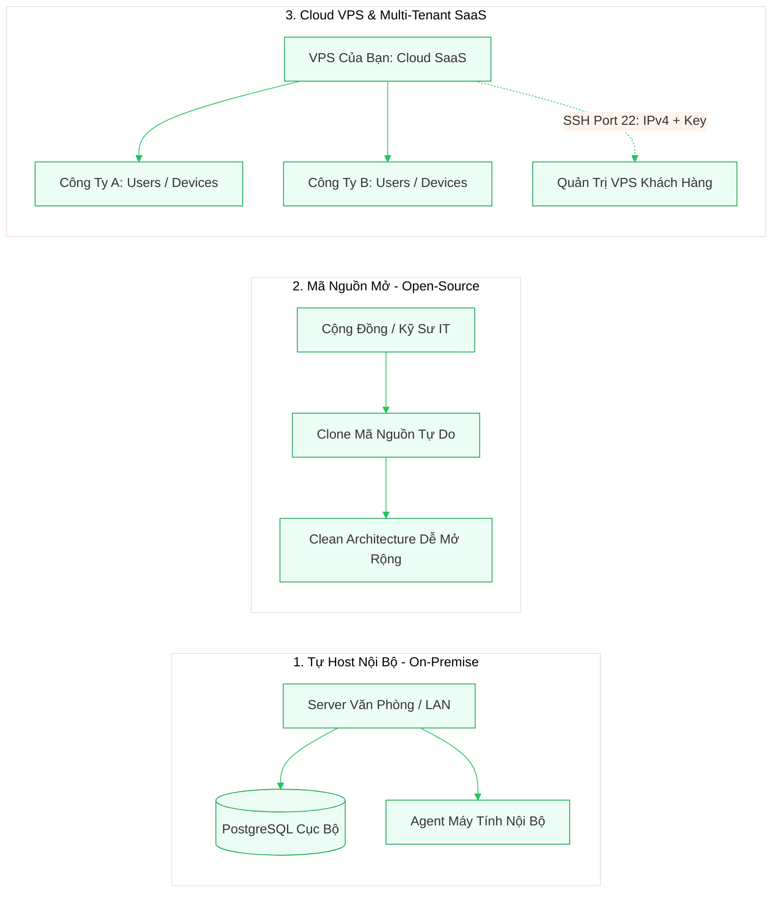

# SentinelLAN

**Hệ sinh thái quản lý, giám sát và bảo vệ thiết bị đầu cuối cùng node máy chủ mạng nội bộ & đám mây**  
*Endpoint Governance, Zero-Trust Management & Cloud Node Administration Platform*

[](SentinelLAN.slnx)
[](apps/web)
[](docs/security/privacy.md)
[](docs/deployment/self-hosted-guide.md)

SentinelLAN là giải pháp quản trị thiết bị đầu cuối (Endpoints: PC, Laptop) và máy chủ đám mây (Cloud Nodes: VPS Linux) theo nguyên tắc **Zero Trust** ("Never Trust, Always Verify") và **Privacy-First** (bảo vệ quyền riêng tư tuyệt đối, nói không với hành vi gián điệp).

---

## 🌟 3 Trụ Cột Cốt Lõi (Core Pillars)



### 1. Tự Host Nội Bộ (Self-Hosted On-Premise)
* **Dành cho:** Các doanh nghiệp, cơ quan, phòng máy, trường học muốn kiểm soát 100% dữ liệu.
* **Đặc điểm:** Triển khai trên máy chủ cục bộ trong văn phòng qua Docker Compose. Toàn bộ telemetry, thông số CPU/RAM/Disk, chính sách và audit trail lưu trữ tại chỗ, không truyền ra ngoài Internet.
* 📖 [Xem chi tiết: Hướng dẫn triển khai Self-Hosted](docs/deployment/self-hosted-guide.md)

### 2. Mã Nguồn Mở (Public Open-Source)
* **Dành cho:** Các đội ngũ kỹ sư, quản trị mạng và cộng đồng phát triển.
* **Đặc điểm:** Thiết kế chuẩn **Clean Architecture / Modular Monolith** bằng .NET 10 và Next.js 16. Phân tách ranh giới rõ ràng: Domain -> Application -> Infrastructure -> API. Mã nguồn sạch, không phụ thuộc vendor lock-in, dễ dàng đóng góp tính năng mới.
* 📖 [Xem chi tiết: Hướng dẫn đóng góp Open Source](docs/deployment/open-source-guide.md)

### 3. Cloud VPS & Multi-Tenant SaaS (Quản trị Cloud Node qua SSH)
* **Dành cho:** Nhà cung cấp dịch vụ IT (MSP), doanh nghiệp bán gói dịch vụ quản lý thiết bị và máy chủ từ xa.
* **Đặc điểm:** 
  * Hỗ trợ **Multi-Tenant** cách ly tuyệt đối theo `OrganizationId`. Một hệ thống có thể phục vụ nhiều công ty khách hàng mà không lo rò rỉ dữ liệu chéo.
  * **Quản trị Cloud VPS qua SSH (Agentless):** Thêm IPv4 + OpenSSH Private Key (được mã hóa bảo vệ bằng `AES-256-GCM` trong Vault). Tự động theo dõi CPU, RAM, Ổ đĩa, trạng thái Docker containers và khởi động lại dịch vụ từ xa.
* 📖 [Xem chi tiết: Hướng dẫn triển khai SaaS & Quản trị VPS](docs/deployment/saas-vps-guide.md)

---

## 🔒 Cam Kết Quyền Riêng Tư (Privacy-First)

> **SentinelLAN bảo vệ an toàn kỹ thuật, không theo dõi nhân viên.**
> - ❌ **KHÔNG** ghi nhận phím gõ (No Keylogger).
> - ❌ **KHÔNG** chụp màn hình hay quay video lén.
> - ❌ **KHÔNG** kích hoạt camera hoặc microphone.
> - ❌ **KHÔNG** đọc trộm tệp tin cá nhân hoặc lịch sử duyệt web.
> - 🛡️ Nhân viên được quyền truy cập trang **My Device Transparency View** (`/my-device`) để xem chính xác IT công ty đang theo dõi chỉ số kỹ thuật gì trên máy mình.

---

## 🚀 Khởi Chạy Nhanh (Quick Start)

### Yêu cầu tiên quyết:
- Đã cài đặt **Docker** & **Docker Compose** (trên Windows, macOS hoặc Linux).

### Chạy toàn bộ hệ thống bằng 1 lệnh:
```bash
# 1. Clone mã nguồn
git clone https://github.com/psy-zney/SentinelLAN.git
cd SentinelLAN

# 2. Tạo file môi trường mẫu
cp .env.example .env

# 3. Khởi chạy toàn bộ hệ thống
docker compose up --build
```

Sau khi các container khởi động hoàn tất:
- **Web Dashboard:** `http://localhost:3000`
- **Backend API:** `http://localhost:8080`
- **Tài liệu OpenAPI 3.1:** `http://localhost:8080/openapi/v1.json`
- **Interactive Presentation & Docs:** Mở trực tiếp [docs/index.html](docs/index.html) trong trình duyệt.

**Tài khoản đăng nhập mặc định:**
- **Mã tổ chức:** `demo`
- **Email:** `admin@sentinellan.local`
- **Mật khẩu:** `local-demo-only`

---

## 💻 Hướng Dẫn Cài Đặt Agent Trên Máy Nhân Viên

Agent là một Windows Service siêu nhẹ, sử dụng cơ chế **Outbound Reverse Connection** (máy tính nhân viên không cần mở port mạng, chỉ gọi một chiều về Server):

1. **IT cấp mã:** Đăng nhập Dashboard -> Vào **Thiết bị** -> Bấm **"+ Cấp token enrollment"** -> Lấy chuỗi Token (hạn 15–60 phút).
2. **Build Agent độc lập (.exe duy nhất):**
   ```powershell
   dotnet publish apps/agent/src/SentinelLAN.Agent/SentinelLAN.Agent.csproj -c Release -r win-x64 --self-contained true -p:PublishSingleFile=true -o ./publish/agent
   ```
3. **Cài đặt trên máy nhân viên:**
   Mở PowerShell (Run as Administrator) và chạy:
   ```powershell
   .\deploy\agent\install-windows-agent.ps1 -ServerUrl "http://<IP-SERVER>:8080" -EnrollToken "CHUOI_TOKEN_O_BUOC_1"
   ```
   *Ngay lập tức, thiết bị sẽ xuất hiện đèn xanh **Online** trên Dashboard của IT!*
4. 📖 [Xem chi tiết: Hướng dẫn kết nối Agent đầy đủ](docs/guides/agent-enrollment-guide.md)

---

## 🛡️ Ma Trận Phân Quyền (RBAC Matrix)

| Chức năng | Admin | Technician | Employee | Agent |
|---|:---:|:---:|:---:|:---:|
| Xem Dashboard & Danh sách thiết bị tổ chức | Có | Có | Chỉ máy được gán | Không |
| Tạo tài khoản nhân viên / Quản lý tổ chức | Có | Không | Không | Không |
| Cấp token enrollment / Gán / Thu hồi thiết bị | Có | Không | Không | Không |
| Tạo, sửa, gán chính sách (Policies) | Có | Có | Chỉ xem policy máy mình | Không |
| Phát lệnh điều khiển an toàn (Safe Commands) | Có | Có | Không | Chỉ nhận lệnh cho máy mình |
| Tiếp nhận & Đóng cảnh báo sự cố (Alerts) | Có | Có | Không | Không |
| Xem nhật ký kiểm toán (Audit Trail) | Có | Không | Chỉ xem 20 thao tác máy mình | Không |
| Gửi Telemetry & Heartbeat | Không | Không | Không | Token / Secret riêng |

---

## 🛠️ Công Nghệ Sử Dụng (Tech Stack)

| Thành phần | Công nghệ / Thư viện chính | Ghi chú |
|---|---|---|
| **Backend API** | .NET SDK `10.0.400`, C# 14, ASP.NET Core `10.0.11` | Clean Architecture, Minimal APIs, Typed Results |
| **Data Access** | EF Core `10.0.11`, Npgsql `10.0.3` | Code-First Migrations, Partial Unique Filter Index |
| **Database** | PostgreSQL `18.1` | Ràng buộc Multi-tenant theo `OrganizationId` |
| **Web Dashboard** | Next.js `16.2.11`, React `19.2.8`, TypeScript `5.9.3` | App Router, Server Components, Turbopack |
| **Styling** | Tailwind CSS `4.3.3`, HSL Token System | Giao diện tối/sáng chuyên nghiệp, Responsive |
| **Realtime** | ASP.NET Core SignalR `10.0.0` | Cập nhật thiết bị, telemetry & lệnh theo mili-giây |
| **Endpoint Agent** | .NET 10 Worker Service | Hỗ trợ Windows Service nền, Windows DPAPI Hardware Vault |
| **Cloud Node SSH** | SSH.NET C# Library | Quản trị VPS Agentless qua SSH Private Key + IPv4 |
| **Testing** | xUnit, Vitest, Playwright | Đầy đủ Unit Tests, Architecture Tests và E2E Browser Tests |

---

## 🧪 Kết Quả Kiểm Thử & Kiểm Chứng (Quality Gates)

Dự án đã vượt qua toàn bộ các cổng kiểm định chất lượng:

```text
[✓] .NET Restore & Format:     Tất cả package up-to-date, format convention chuẩn.
[✓] .NET Build:                0 lỗi, 0 cảnh báo quan trọng.
[✓] .NET Test Suite:           79/79 TESTS PASS (Architecture, Domain, Agent, Application, Integration).
[✓] Web TypeScript:            0 lỗi kiểu dữ liệu (Strict Mode).
[✓] Web ESLint:                0 error, 0 warning (Tuân thủ React 19 Hooks quy chuẩn).
[✓] Web Unit Tests:            9/9 Vitest tests PASS.
[✓] Web Production Build:      Next.js Turbopack compile thành công 8 static & dynamic routes.
[✓] Playwright E2E:            Luồng Admin Device Lifecycle hoàn thành trọn vẹn.
```

Chạy toàn bộ kiểm thử bằng kịch bản tự động:
```powershell
./scripts/test-all.ps1
```

---

## 📚 Hệ Thống Tài Liệu Chi Tiết

- 🌐 [Cổng Thuyết Trình & Tài Liệu Tương Tác (HTML Portal)](docs/index.html)
- 🏢 [Hướng Dẫn Triển Khai Self-Hosted On-Premise](docs/deployment/self-hosted-guide.md)
- ☁️ [Hướng Dẫn Triển Khai Cloud VPS SaaS & Node Management](docs/deployment/saas-vps-guide.md)
- 🤝 [Hướng Dẫn Phát Triển Dành Cho Cộng Đồng Mã Nguồn Mở](docs/deployment/open-source-guide.md)
- 💻 [Hướng Dẫn Chi Tiết Cài Đặt & Kết Nối Windows Agent](docs/guides/agent-enrollment-guide.md)
- 🏛️ [Kế Hoạch & Kết Quả Triển Khai MVP](MVP_IMPLEMENTATION_PLAN.md)
- 📐 [Quyết Định Kiến Trúc: ADR 0005](docs/adr/0005-mvp-administration-and-simulation.md)
