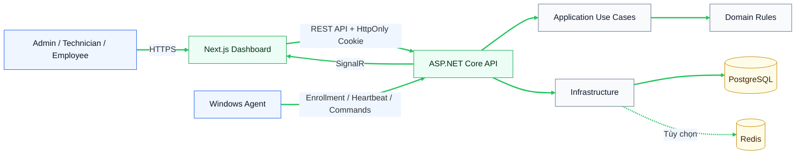
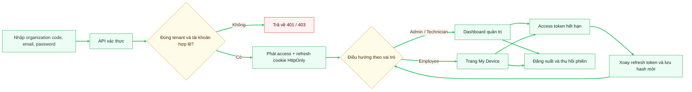

# SentinelLAN

**Hệ thống quản lý, giám sát và bảo vệ thiết bị đầu cuối trong mạng nội bộ**

**Development of an Endpoint Management, Monitoring and Protection System for Local Area Networks**

SentinelLAN là MVP quản lý endpoint trong mạng LAN dành cho doanh nghiệp, trung tâm đào tạo và phòng máy. Hệ thống gồm dashboard quản trị, API ASP.NET Core, PostgreSQL và Agent chạy trên Windows theo nguyên tắc tối thiểu quyền.

> SentinelLAN chỉ thu thập telemetry kỹ thuật đã công bố. Hệ thống không ghi phím, chụp màn hình, đọc tệp cá nhân, lịch sử duyệt web, camera, microphone hoặc thông tin đăng nhập. Khóa máy và cô lập mạng trong MVP chỉ là mô phỏng an toàn.

## Trạng thái dự án

| Hạng mục | Trạng thái |
|---|---|
| Phiên đăng nhập, refresh token và đăng xuất | Hoàn thành trong Week 1 |
| Phân quyền Admin, Technician, Employee và Agent | Hoàn thành trong Week 1 |
| Cô lập dữ liệu theo tenant và thiết bị được gán | Hoàn thành trong Week 1 |
| Enrollment, heartbeat và telemetry cơ bản | Đã kiểm chứng local; chờ gate PostgreSQL Week 2 |
| Dashboard thiết bị và cập nhật SignalR | Đã kiểm chứng local; chờ gate PostgreSQL Week 2 |
| Policy, alert và audit đầy đủ | Đang phát triển theo roadmap |
| Khóa/cô lập thiết bị thật | Tắt mặc định; chỉ được phép trong lab có ủy quyền |

Phiên bản hiện tại: `0.1.0`. Kết quả kiểm tra ngày 06/09/2026 và điều kiện chuyển Week 3: [VERIFICATION.md](VERIFICATION.md).

## Phạm vi và vai trò

| Vai trò | Phạm vi sử dụng |
|---|---|
| **Admin** | Quản lý người dùng, thiết bị, policy; tạo lệnh an toàn; xem cảnh báo và audit trong tenant |
| **Technician** | Theo dõi thiết bị, xử lý cảnh báo và thực hiện hành động được cấp quyền kèm lý do |
| **Employee** | Chỉ xem thiết bị được gán, telemetry đã công bố, policy và lịch sử hành động liên quan |
| **Agent** | Enrollment một lần, gửi heartbeat/telemetry, nhận lệnh trong allow-list và báo kết quả |

Các chức năng chính:

- Đăng nhập bằng mã tổ chức, email và mật khẩu.
- Access token ngắn hạn và refresh token xoay vòng trong cookie `HttpOnly`.
- Phân quyền theo vai trò và giới hạn dữ liệu bằng `OrganizationId`.
- Danh sách, chi tiết và trạng thái online/offline của thiết bị.
- Agent enrollment, heartbeat, polling lệnh và gửi kết quả.
- Cập nhật trạng thái thiết bị/lệnh qua SignalR.
- Lệnh có loại cho phép, lý do, thời hạn, nonce, chữ ký và audit.
- Giao diện riêng cho Employee tại `/my-device`.

## Kiến trúc hệ thống



Quy tắc phụ thuộc backend:

```text
Api → Infrastructure → Application → Domain
```

- `Domain` chứa quy tắc nghiệp vụ và không phụ thuộc Infrastructure.
- `Application` sở hữu use case, contract, validation, authorization và tenant scope.
- `Infrastructure` triển khai EF Core, PostgreSQL, hashing, token và tích hợp.
- `Api` là composition root và transport boundary.
- Các module giao tiếp qua contract/event, không đọc trực tiếp bảng của module khác.
- Agent Core không phụ thuộc hệ điều hành; adapter HTTP/OS nằm trong Agent Infrastructure.

## Luồng hoạt động chính

### Phiên đăng nhập người dùng



### Agent, telemetry và lệnh an toàn

```mermaid
%%{init: {"theme":"base","themeVariables":{"fontFamily":"Arial","primaryColor":"#ecfdf5","primaryBorderColor":"#16a34a","lineColor":"#22c55e"}}}%%
flowchart LR
    TOKEN[Enrollment token dùng một lần] --> ENROLL[Agent đăng ký thiết bị]
    ENROLL --> ID[Nhận Device ID và credential riêng]
    ID --> HEART[Thu thập telemetry kỹ thuật tối thiểu]
    HEART --> API[Heartbeat có xác thực]
    API --> STORE[(Lưu vào PostgreSQL)]
    STORE --> HUB[Phát device-status qua SignalR]
    HUB --> UI[Dashboard cập nhật online / offline]
    UI --> CMD[Tạo lệnh allow-list kèm lý do]
    CMD --> SIGN[Ký lệnh, thêm expiry + nonce + audit]
    SIGN --> POLL[Agent polling và xác minh lệnh]
    POLL --> SAFE[Thực thi mô phỏng an toàn]
    SAFE --> RESULT[Gửi kết quả idempotent]
    RESULT --> STORE

    classDef agent fill:#eff6ff,stroke:#2563eb,color:#0f172a;
    classDef safe fill:#ecfdf5,stroke:#16a34a,color:#052e16;
    classDef data fill:#fefce8,stroke:#ca8a04,color:#422006;
    class TOKEN,ENROLL,ID,HEART,POLL,SAFE,RESULT agent;
    class API,HUB,UI,CMD,SIGN safe;
    class STORE data;
    linkStyle default stroke:#22c55e,stroke-width:2.5px;
```



Telemetry được phép gồm trạng thái online, hostname/tên thiết bị, phiên bản hệ điều hành, phiên bản Agent, CPU, RAM, ổ đĩa và thời điểm hoạt động gần nhất.

## Công nghệ sử dụng

| Thành phần | Công nghệ/Phiên bản |
|---|---|
| Backend | .NET SDK `10.0.400`, C# 14, ASP.NET Core `10.0.11` |
| Data access | EF Core `10.0.11`, Npgsql EF Core `10.0.3` |
| Database | PostgreSQL `18.1` |
| Frontend | Next.js `16.2.11`, React `19.2.8` |
| Ngôn ngữ web | TypeScript `5.9.3` strict |
| Giao diện | Tailwind CSS `4.3.3` |
| Realtime | SignalR `10.0.0` |
| Agent | .NET Worker Service, hỗ trợ Windows Service |
| Test | xUnit, Vitest, Playwright |
| CI | GitHub Actions |
| Cache tùy chọn | Redis `8.2.1`, Compose profile `extended` |

## Cấu trúc repository

```text
SentinelLAN/
├── apps/
│   ├── backend/
│   │   ├── src/        # Domain, Application, Infrastructure, Api
│   │   └── tests/      # Domain, Application, Architecture, Integration
│   ├── agent/
│   │   ├── src/        # Agent Core, Infrastructure và Worker
│   │   └── tests/      # Kiểm thử Agent
│   └── web/
│       ├── src/        # Next.js, component, hook, typed API client
│       └── tests/      # Vitest và Playwright E2E
├── packages/           # API client và shared config
├── deploy/docker/      # Dockerfile cho API và web
├── docs/               # API, security, database và kế hoạch
├── scripts/            # Kịch bản kiểm thử PowerShell/Bash
├── compose.yaml        # PostgreSQL, API, web và Redis tùy chọn
├── SentinelLAN.slnx    # .NET solution
└── package.json        # npm workspace
```

## Khởi chạy nhanh bằng Docker

Yêu cầu: Docker Engine 28+, Docker Compose v2, Git và các cổng `3000`, `5432`, `8080` đang trống.

```powershell
Copy-Item .env.example .env
# Thay các giá trị development trong .env, sau đó:
docker compose up --build
```

Không commit file `.env`. Sau khi các service sẵn sàng:

| Dịch vụ | Địa chỉ |
|---|---|
| Dashboard | `http://localhost:3000` |
| API | `http://localhost:8080` |
| Live health | `http://localhost:8080/health/live` |
| Ready health | `http://localhost:8080/health/ready` |
| OpenAPI 3.1 | `http://localhost:8080/openapi/v1.json` |
| PostgreSQL | `localhost:5432` |

Dừng hệ thống nhưng giữ volume dữ liệu:

```powershell
docker compose down
```

Bật thêm Redis khi cần:

```powershell
docker compose --profile extended up --build
```

## Chạy từng thành phần

### PostgreSQL và API

```powershell
docker compose up -d postgres
$env:ASPNETCORE_URLS = 'http://localhost:8080'
$env:ConnectionStrings__SentinelLAN = 'Host=localhost;Port=5432;Database=sentinellan;Username=sentinellan;Password=change-me-for-local-development'
$env:SENTINELLAN_ACCESS_TOKEN_SIGNING_KEY = 'replace-with-at-least-32-random-characters'
$env:SENTINELLAN_WEB_ORIGINS = 'http://localhost:3000'
dotnet run --project apps/backend/src/SentinelLAN.Api
```

Trong Development, nếu không có connection string thì API dùng InMemory database.

### Web dashboard

```powershell
npm.cmd ci
$env:NEXT_PUBLIC_API_URL = 'http://localhost:8080'
npm.cmd run dev
```

### Agent

```powershell
$env:SENTINELLAN_API_URL = 'http://localhost:8080'
$env:SENTINELLAN_ENROLLMENT_TOKEN = 'local-enroll-only'
dotnet run --project apps/agent/src/SentinelLAN.Agent
```

Để nhận lệnh trong MVP, cấu hình cùng `SENTINELLAN_SIGNING_KEY` ở API và Agent. Nếu thiếu key, Agent chỉ gửi telemetry và không polling lệnh. Agent đang dùng identity store dạng tệp trong thư mục `agent-data` cho Development. Production phải dùng kho credential được hệ điều hành bảo vệ. Agent không cần quyền Administrator trong phạm vi MVP.

## Tài khoản demo

Compose tự seed organization `demo`. Mật khẩu của cả ba tài khoản lấy từ `SENTINELLAN_DEMO_ADMIN_PASSWORD`.

| Vai trò | Email | Organization code |
|---|---|---|
| Admin | `admin@sentinellan.local` | `demo` |
| Technician | `technician@sentinellan.local` | `demo` |
| Employee | `employee@sentinellan.local` | `demo` |

Mật khẩu Development mặc định của Compose là `local-demo-only`. Không sử dụng giá trị này ngoài máy local.

## Cấu hình môi trường

| Biến | Mục đích |
|---|---|
| `ConnectionStrings__SentinelLAN` | Chuỗi kết nối PostgreSQL |
| `POSTGRES_DB`, `POSTGRES_USER`, `POSTGRES_PASSWORD` | Cấu hình PostgreSQL trong Compose |
| `SENTINELLAN_DEMO_ADMIN_EMAIL` | Email Admin demo |
| `SENTINELLAN_DEMO_ADMIN_PASSWORD` | Mật khẩu dùng để seed tài khoản demo |
| `SENTINELLAN_ENROLLMENT_TOKEN` | Token enrollment một lần |
| `SENTINELLAN_SIGNING_KEY` | Khóa HMAC chung API/Agent trong MVP; Agent không polling lệnh khi thiếu key |
| `SENTINELLAN_ACCESS_TOKEN_SIGNING_KEY` | Khóa access token, tối thiểu 32 ký tự ngoài Development |
| `SENTINELLAN_WEB_ORIGINS` | Origin web được phép gửi credential |
| `NEXT_PUBLIC_API_URL` | URL API dành cho dashboard |
| `SENTINELLAN_API_URL` | URL API dành cho Agent |
| `SENTINELLAN_ALLOW_REAL_COMMANDS` | Cờ lab cho adapter thật; mặc định `false` |

Secrets chỉ đến từ environment variable hoặc user-secrets. Không commit `.env`, token, certificate, database dump, log hoặc device credential.

## API chính

Các endpoint được version hóa dưới `/api/v1`.

| Method | Endpoint | Chức năng | Quyền |
|---|---|---|---|
| `POST` | `/auth/login` | Đăng nhập và tạo cookie phiên | Public, rate limit |
| `GET` | `/auth/session` | Đọc phiên hiện tại | Đã đăng nhập |
| `POST` | `/auth/refresh` | Xoay refresh token | Refresh cookie |
| `POST` | `/auth/logout` | Thu hồi phiên | Đã đăng nhập |
| `GET` | `/dashboard` | Số liệu dashboard theo tenant | Admin/Technician |
| `GET` | `/devices` | Danh sách thiết bị theo tenant | Admin/Technician |
| `GET` | `/devices/{id}` | Chi tiết thiết bị có scope | Có quyền |
| `GET` | `/my-device` | Thiết bị được gán | Employee |
| `POST` | `/agent/enroll` | Enrollment thiết bị | One-time token |
| `POST` | `/agent/heartbeat` | Gửi heartbeat/telemetry | Agent |
| `POST` | `/commands` | Tạo lệnh an toàn kèm lý do | Admin/Technician |
| `POST` | `/agent/commands/poll` | Nhận lệnh | Agent |
| `POST` | `/agent/commands/{id}/result` | Gửi kết quả | Agent |
| `GET` | `/audit-logs` | Xem audit theo tenant | Admin |

Request thay đổi trạng thái dùng cookie phải gửi `X-SentinelLAN-CSRF: 1`. Agent dùng `X-SentinelLAN-Device-Id` và `X-SentinelLAN-Device-Secret`; secret không nằm trong URL hoặc payload nghiệp vụ.

## Bảo mật và quyền riêng tư

- Mật khẩu được hash bằng PBKDF2-SHA256 với salt ngẫu nhiên.
- Access token có thời hạn 15 phút; refresh token có thời hạn 7 ngày.
- Refresh token chỉ lưu SHA-256 hash, xoay vòng khi dùng và thu hồi token family khi phát hiện reuse.
- Cookie xác thực là host-only, `HttpOnly`, `SameSite=Strict` và dùng `Secure` trên HTTPS.
- Người dùng và Agent dùng hai cơ chế xác thực độc lập.
- Record thuộc tenant có `OrganizationId`; route ID không tự tạo quyền truy cập.
- Employee chỉ truy vấn thiết bị đúng `OrganizationId` và `AssignedUserId`.
- SignalR được xác thực và chia group theo organization.
- Lệnh cần loại hợp lệ, actor, lý do, issued/expiry, nonce, chữ ký và audit.
- Lệnh hết hạn, replay, sai tenant/thiết bị hoặc kết quả trùng bị từ chối.
- `SimulateLock` và `SimulateNetworkIsolation` không thay đổi hệ điều hành.

Trước production cần bổ sung MFA, managed signing-key rotation, OS-protected credential store, chữ ký Agent bất đối xứng, retention automation và external immutable audit sink.

## Kiểm thử và CI

```powershell
# Backend
dotnet restore SentinelLAN.slnx
dotnet format SentinelLAN.slnx
dotnet build SentinelLAN.slnx --configuration Release
dotnet test SentinelLAN.slnx --configuration Release

# Frontend
npm.cmd ci
npm.cmd run lint
npm.cmd run typecheck
npm.cmd test
npm.cmd run build
npm.cmd run test:e2e

# Toàn bộ repository
./scripts/test-all.ps1
```

Linux/macOS dùng `./scripts/test-all.sh`.

Các gate CI cần cấu hình (checkout này chưa có `.github/workflows`; chưa xác minh CI từ xa):

1. **CI:** format, build, backend tests, frontend lint/typecheck/test/build và Playwright E2E với PostgreSQL.
2. **Security:** quét package NuGet và chạy `npm audit --audit-level=high`.
3. **Pull Request Policy:** kiểm tra tên nhánh, target và tiêu đề Conventional Commit.

## Giới hạn hiện tại

SentinelLAN là MVP phục vụ học tập, trình diễn và kiểm thử trong môi trường được ủy quyền; chưa phải endpoint protection production-ready. Không bật khóa/cô lập thật ngoài lab. Repository chưa khai báo giấy phép nguồn mở, vì vậy không mặc định cho phép sử dụng hoặc phân phối lại ngoài phạm vi được chủ sở hữu chấp thuận.
