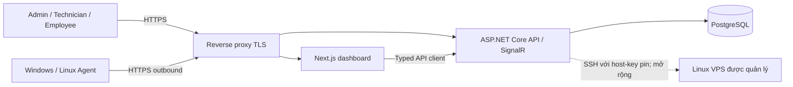

# Bối cảnh và topology

SentinelLAN quản lý các thiết bị đầu cuối được tổ chức cho phép. Admin và Technician dùng dashboard để quản trị; Employee xem thiết bị được gán. Agent trên máy được quản lý gửi telemetry kỹ thuật qua HTTPS. Kết nối SSH tới VPS đã đăng ký là chức năng mở rộng riêng; VPS này không cần cài Agent để dùng chức năng SSH.

Trong Development, `compose.yaml` chạy PostgreSQL, API và web; Agent chạy trên host. Stack Production trong `deploy/vps/` thêm Nginx TLS và không tạo dữ liệu demo. Các bước vận hành nằm trong [hướng dẫn LAN](../deployment/self-hosted-guide.md) và [hướng dẫn VPS](../deployment/saas-vps-guide.md). Redis không thuộc stack đang dùng.

Mỗi yêu cầu phải kiểm tra quyền và `OrganizationId` tại boundary ứng dụng. Tenant scope hiện được áp dụng tường minh trong truy vấn; không có EF Core global query filter hay database row-level security. Audit được bảo vệ khỏi sửa/xóa qua `SentinelDbContext`, chưa phải sổ cái bất biến ở mức database. Xem [mô hình đe dọa](../security/threat-model.md) và [các thành phần](components.md).

Lệnh Agent `SimulateLock`, `SimulateNetworkIsolation` và `RestartService` chỉ mô phỏng, không đổi hệ điều hành. Thao tác restart dịch vụ qua SSH của chức năng quản trị VPS là thao tác thật, yêu cầu quyền, lý do, xác nhận, nonce và SSH host-key fingerprint đã xác minh.
