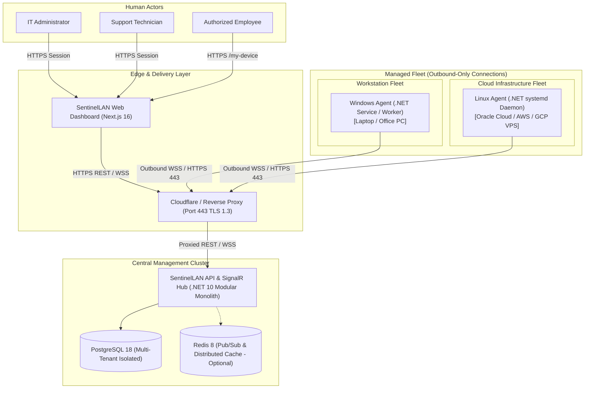

# System Context & Operational Scope

SentinelLAN is an authorized, privacy-first endpoint and cloud node governance platform built on **Zero Trust principles (NIST SP 800-207)** and **Privacy-by-Design**.

It serves a dual operational scope:
1. **Workstation Governance (Windows Endpoints)**: Hardware asset tracking, non-invasive health telemetry, policy enforcement, and authorized emergency intervention (e.g., workstation lock) for office and hybrid remote employees.
2. **Cloud Infrastructure Governance (Linux VPS Nodes)**: Centralized "single pane of glass" monitoring and allow-listed service recovery (e.g., restarting Nginx or Docker services) across multi-cloud providers (Oracle Cloud, AWS, GCP) without requiring open inbound SSH/management ports.

## Connectivity Invariants
- **Outbound-Only Architecture**: Managed agents connect outbound to the central API via TLS 1.3 (HTTPS / WebSocket). Endpoints and cloud servers operate safely behind NAT and firewalls without requiring inbound port forwarding or exposed SSH (Port 22).
- **Tenant Isolation**: Every query and realtime SignalR group is partitioned strictly by `OrganizationId`. Cross-tenant data leakage is prevented at the database and memory layer.
- **Privacy Boundary**: Employee transparency is enforced by design; no covert surveillance, screen captures, keystrokes, or arbitrary remote shell execution are supported.

