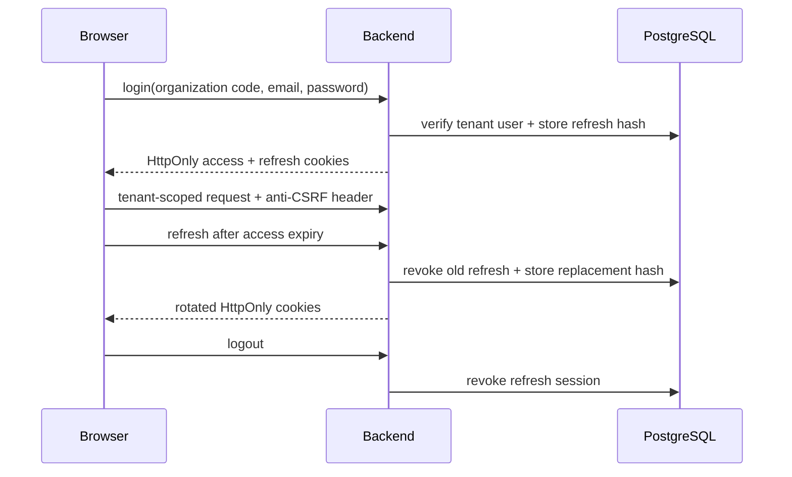
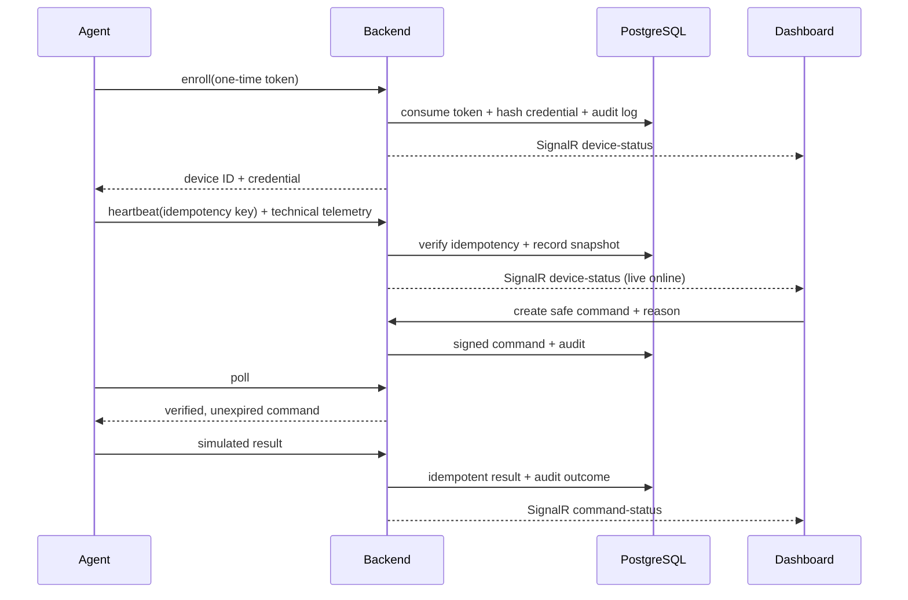
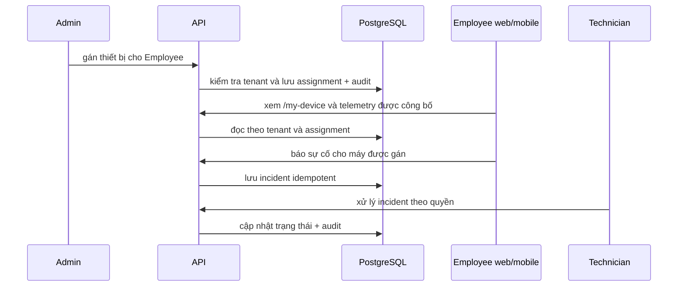

# Luồng dữ liệu lõi

Các sơ đồ dưới đây cùng mô tả vòng đời thiết bị đầu cuối được ủy quyền. Quản trị VPS qua SSH là phần mở rộng riêng, không nằm trong chuỗi này.

Agent command trong sơ đồ trên trả kết quả mô phỏng; quy trình cô lập thật chưa được triển khai. Restart dịch vụ VPS qua SSH là luồng riêng, có host-key pinning, quyền, lý do, xác nhận, nonce và audit; xem [bối cảnh](context.md) và [threat model](../security/threat-model.md).

