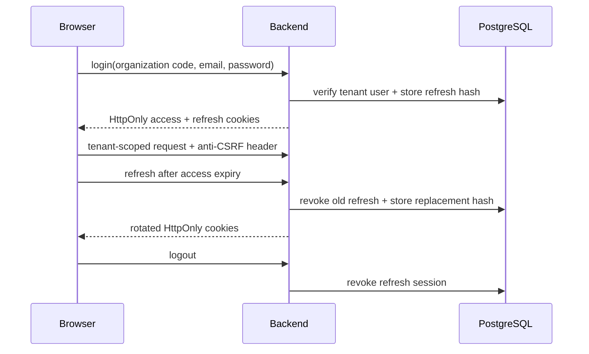
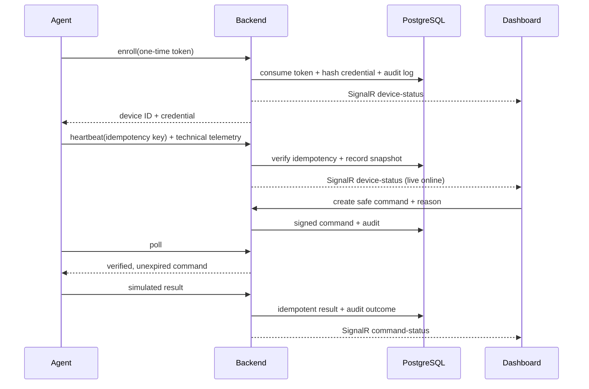
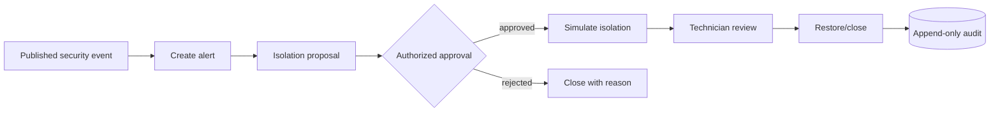

# Critical data flows

```mermaid
sequenceDiagram
  participant B as Browser
  participant API as Backend
  participant DB as PostgreSQL
  B->>API: login(organization code, email, password)
  API->>DB: verify tenant user + store refresh hash
  API-->>B: HttpOnly access + refresh cookies
  B->>API: tenant-scoped request + anti-CSRF header
  B->>API: refresh after access expiry
  API->>DB: revoke old refresh + store replacement hash
  API-->>B: rotated HttpOnly cookies
  B->>API: logout
  API->>DB: revoke refresh session
```

```mermaid
sequenceDiagram
  participant A as Agent
  participant API as Backend
  participant DB as PostgreSQL
  participant W as Dashboard
  A->>API: enroll(one-time token)
  API->>DB: consume token + hash credential + audit log
  API-->>W: SignalR device-status
  API-->>A: device ID + credential
  A->>API: heartbeat(idempotency key) + technical telemetry
  API->>DB: verify idempotency + record snapshot
  API-->>W: SignalR device-status (live online)
  W->>API: create safe command + reason
  API->>DB: signed command + audit
  A->>API: poll
  API-->>A: verified, unexpired command
  A->>API: simulated result
  API->>DB: idempotent result + audit outcome
  API-->>W: SignalR command-status
```

```mermaid
flowchart LR
  Event[Published security event] --> Alert[Create alert]
  Alert --> Proposal[Isolation proposal]
  Proposal --> Approval{Authorized approval}
  Approval -->|approved| Simulate[Simulate isolation]
  Approval -->|rejected| Close[Close with reason]
  Simulate --> Review[Technician review]
  Review --> Recover[Restore/close]
  Recover --> Audit[(Append-only audit)]
```
