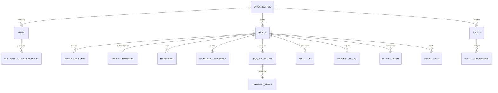

# Entity relationship overview

Sơ đồ chỉ tóm tắt các quan hệ nghiệp vụ chính. Schema EF Core và migration là nguồn chuẩn cho bảng, cột, constraint và index hiện hành. SQL hiện tại chưa khai báo foreign key vật lý giữa các bảng nghiệp vụ; tính toàn vẹn liên bảng phụ thuộc kiểm tra của ứng dụng. Xem [SQL PostgreSQL sinh từ migrations](schema.postgresql.sql), [bản đồ hệ thống HTML](../system-map.html) và [data dictionary](data-dictionary.md).

