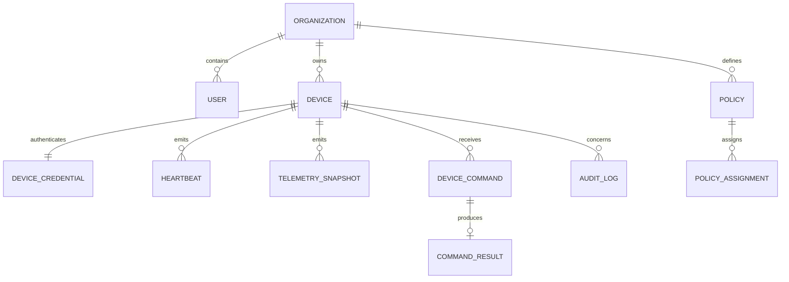

# Entity relationship overview

```mermaid
erDiagram
  ORGANIZATION ||--o{ USER : contains
  ORGANIZATION ||--o{ DEVICE : owns
  DEVICE ||--|| DEVICE_CREDENTIAL : authenticates
  DEVICE ||--o{ HEARTBEAT : emits
  DEVICE ||--o{ TELEMETRY_SNAPSHOT : emits
  DEVICE ||--o{ DEVICE_COMMAND : receives
  DEVICE_COMMAND ||--o| COMMAND_RESULT : produces
  ORGANIZATION ||--o{ POLICY : defines
  POLICY ||--o{ POLICY_ASSIGNMENT : assigns
  DEVICE ||--o{ AUDIT_LOG : concerns
```
