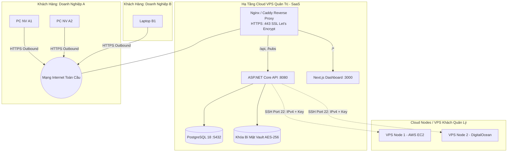

# Hướng Dẫn Triển Khai SaaS Trên Cloud VPS & Quản Trị Server Node

Tài liệu này hướng dẫn cách deploy hệ thống **SentinelLAN** lên một máy chủ Cloud VPS công cộng (Ubuntu/Debian) để cung cấp dịch vụ quản trị đa tổ chức (Multi-Tenant SaaS), đồng thời tích hợp quản trị các Server/Node từ xa qua SSH.

---

## 1. Mô hình kiến trúc Cloud SaaS & Node Governance



---

## 2. Chuẩn bị máy chủ Cloud VPS

1. **Thuê VPS:** Cấu hình đề xuất tối thiểu 2 vCPU, 4 GB RAM, 40 GB NVMe SSD (tại Hetzner, DigitalOcean, Vultr, Viettel Cloud, FPT Cloud...).
2. **Cấu hình Tên miền (DNS):** Trỏ domain của bạn về IPv4 của VPS:
   - `dashboard.yourdomain.com` -> IPv4 VPS
   - `api.yourdomain.com` -> IPv4 VPS
3. **Cài đặt Docker & Docker Compose trên VPS:**
   ```bash
   curl -fsSL https://get.docker.com | sh
   sudo usermod -aG docker $USER
   ```

---

## 3. Cấu hình Nginx Reverse Proxy với HTTPS tự động

Cài đặt Nginx và Certbot:
```bash
sudo apt update && sudo apt install -y nginx certbot python3-certbot-nginx
```

Tạo cấu hình Nginx tại `/etc/nginx/sites-available/sentinellan`:
```nginx
# Web Dashboard
server {
    server_name dashboard.yourdomain.com;

    location / {
        proxy_pass http://127.0.0.1:3000;
        proxy_http_version 1.1;
        proxy_set_header Upgrade $http_upgrade;
        proxy_set_header Connection "upgrade";
        proxy_set_header Host $host;
        proxy_set_header X-Real-IP $remote_addr;
        proxy_set_header X-Forwarded-For $proxy_add_x_forwarded_for;
        proxy_set_header X-Forwarded-Proto $scheme;
    }
}

# Backend API & SignalR WebSockets
server {
    server_name api.yourdomain.com;

    location / {
        proxy_pass http://127.0.0.1:8080;
        proxy_http_version 1.1;
        proxy_set_header Upgrade $http_upgrade;
        proxy_set_header Connection "upgrade";
        proxy_set_header Host $host;
        proxy_set_header X-Real-IP $remote_addr;
        proxy_set_header X-Forwarded-For $proxy_add_x_forwarded_for;
        proxy_set_header X-Forwarded-Proto $scheme;
        proxy_read_timeout 86400s;
        proxy_send_timeout 86400s;
    }
}
```

Kích hoạt và lấy chứng chỉ SSL Let's Encrypt miễn phí:
```bash
sudo ln -s /etc/nginx/sites-available/sentinellan /etc/nginx/sites-enabled/
sudo nginx -t && sudo systemctl reload nginx
sudo certbot --nginx -d dashboard.yourdomain.com -d api.yourdomain.com
```

---

## 4. Cấu hình Môi trường Sản phẩm (.env) trên VPS

Trong thư mục `SentinelLAN`:
```env
# URL công khai chạy HTTPS
NEXT_PUBLIC_API_URL=https://api.yourdomain.com
SENTINELLAN_WEB_ORIGINS=https://dashboard.yourdomain.com

# Database Production
POSTGRES_DB=sentinellan_prod
POSTGRES_USER=sentinellan_prod
POSTGRES_PASSWORD=MatKhauDatabaseSanXuatCucKhoDoan123!

# Khóa bí mật bắt buộc (tối thiểu 32 ký tự ngẫu nhiên, không dùng chuỗi mặc định)
SENTINELLAN_ACCESS_TOKEN_SIGNING_KEY=ChuoiNgauNhienMHMAC256JwtChoSaaSTrenVps2026!
SENTINELLAN_SIGNING_KEY=ChuoiKyTuBaoVeAgentCommandSignatureChuanSecurity!
SENTINELLAN_SERVER_VAULT_KEY=ChuoiMasterKeyMaHoaPrivateKeyVpsNodeAES256Gcm!

# Tài khoản Quản trị Nền tảng (Super Admin)
SENTINELLAN_DEMO_ADMIN_EMAIL=superadmin@yourdomain.com
SENTINELLAN_DEMO_ADMIN_PASSWORD=MatKhauSuperAdminSieuCapBaoMat@!
```

Khởi chạy hệ sinh thái:
```bash
docker compose up -d --build
```

---

## 5. Quản trị VPS Node từ xa (SSH Private Key + IPv4)

Ngoài việc quản lý các máy tính văn phòng qua Agent, SentinelLAN hỗ trợ giám sát và thực thi lệnh trên các VPS Linux từ xa bằng giao thức SSH.

### A. Cơ chế bảo mật Private Key:
1. **Không lưu Plain-text:** Khóa bí mật SSH Private Key khi nhập từ giao diện sẽ được mã hóa bằng thuật toán `AES-256-GCM` với khóa chủ `SENTINELLAN_SERVER_VAULT_KEY` trước khi lưu vào Database.
2. **Giải mã tức thời trong RAM:** Khóa chỉ được giải mã tạm thời trong bộ nhớ RAM của tiến trình backend tại thời điểm thực thi lệnh SSH và hủy ngay sau khi đóng kết nối.

### B. Quy trình thêm VPS Node vào quản lý:
1. Đăng nhập Dashboard với quyền **Admin**.
2. Vào mục **Cloud Nodes (VPS)** -> Bấm **"+ Thêm VPS Node"**.
3. Điền các thông số:
   - **Tên Node:** `Hanoi-Production-App`
   - **Địa chỉ IPv4:** `103.x.x.x`
   - **Port SSH:** `22` (hoặc cổng SSH tùy chỉnh của bạn)
   - **Username:** `root` hoặc `ubuntu`
   - **Private Key:** Paste nội dung file OpenSSH Private Key (`id_rsa` hoặc `id_ed25519`).
4. Bấm **"Kiểm tra kết nối & Lưu"**:
   - Backend sẽ dùng thư viện `SSH.NET` để mở handshake SSH test.
   - Khi kết nối thành công, hệ thống bắt đầu định kỳ 30s thu thập các thông số kỹ thuật: CPU Load, RAM sử dụng (`free -m`), Dung lượng ổ cứng (`df -h /`), danh sách Docker containers đang chạy (`docker ps`).

---

## 6. Mô hình Bán Dịch vụ (SaaS Multi-Tenant Onboarding)

Khi có một công ty khách hàng mới mua dịch vụ:
1. **Super Admin tạo Tổ chức (Tenant):**
   - Vào mục Quản lý Tổ chức -> Tạo mới công ty `CongTyABC` với mã định danh duy nhất `abc-corp`.
   - Tạo tài khoản Admin đầu tiên cho công ty đó: `admin@abc-corp.vn`.
2. **Bàn giao tài khoản:**
   - Khách hàng đăng nhập tại `https://dashboard.yourdomain.com` với mã tổ chức `abc-corp`.
   - Khách hàng tự vào tạo tài khoản nhân viên, cấp token enrollment và quản lý máy tính của công ty họ.
   - **Toàn bộ dữ liệu của `CongTyABC` hoàn toàn cô lập, công ty khác không thể thấy.**
