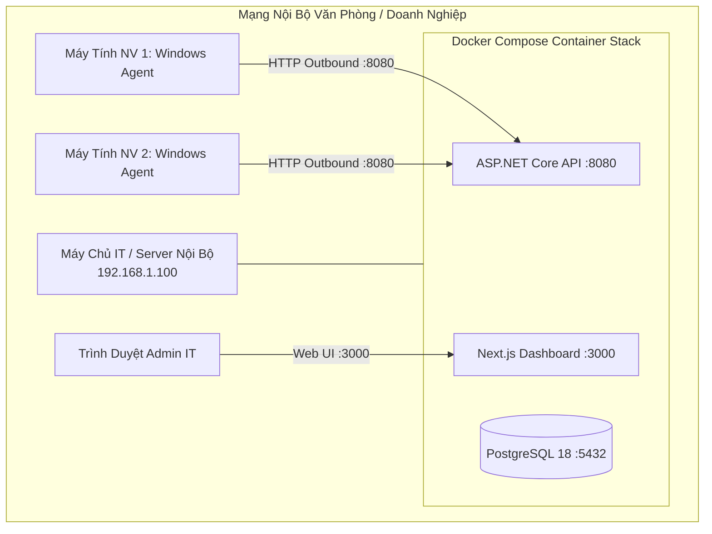

# Hướng Dẫn Triển Khai Self-Hosted On-Premise (Tự Host Nội Bộ)

Tài liệu này hướng dẫn các tổ chức, doanh nghiệp, phòng lab tự triển khai hệ thống **SentinelLAN** trên hạ tầng máy chủ cục bộ trong mạng nội bộ (LAN), bảo đảm 100% dữ liệu không rời khỏi văn phòng.

---

## 1. Mô hình kiến trúc Self-Hosted



### Ưu điểm của mô hình Self-Hosted:
- **Bảo mật tuyệt đối:** Toàn bộ telemetry, thông số phần cứng, chính sách và lịch sử kiểm toán lưu trữ trên máy chủ nội bộ.
- **Không tốn băng thông Internet:** Agent và Server giao tiếp trực tiếp qua switch/Wi-Fi văn phòng.
- **Không phụ thuộc Cloud bên thứ ba:** Hoạt động ổn định ngay cả khi văn phòng mất kết nối Internet quốc tế.

---

## 2. Yêu cầu hệ thống máy chủ (IT Server)

- **Hệ điều hành:** Ubuntu Server 22.04/24.04 LTS, Debian 12, hoặc Windows 10/11 Pro, Windows Server.
- **Phần cứng tối thiểu:** 2 CPU Cores, 4 GB RAM, 20 GB ổ cứng trống.
- **Phần mềm cần có:**
  - Docker Engine 24+ & Docker Compose v2.
  - Cổng mạng cần mở trong Firewall nội bộ: `3000` (Web UI), `8080` (API & Agent Communication).

---

## 3. Các bước triển khai chi tiết

### Bước 1: Chuẩn bị mã nguồn và cấu hình môi trường
Trên máy chủ nội bộ của IT, clone repository và tạo file cấu hình:

```bash
git clone https://github.com/your-org/SentinelLAN.git
cd SentinelLAN
cp .env.example .env
```

Chỉnh sửa file `.env` với các giá trị an toàn cho văn phòng của bạn:
```env
# Địa chỉ IP của máy chủ IT trong mạng LAN
NEXT_PUBLIC_API_URL=http://192.168.1.100:8080
SENTINELLAN_WEB_ORIGINS=http://192.168.1.100:3000,http://localhost:3000

# Mật khẩu database nội bộ
POSTGRES_DB=sentinellan
POSTGRES_USER=sentinellan
POSTGRES_PASSWORD=MatKhauDatabaseRatKhoDoan2026!

# Khóa bí mật token và chữ ký lệnh (tối thiểu 32 ký tự ngẫu nhiên)
SENTINELLAN_ACCESS_TOKEN_SIGNING_KEY=ChuoiKyTuBaoMatAccessTokenRatDaiToiThieu32KyTu!
SENTINELLAN_SIGNING_KEY=KhayHMACSharedChoCommandAllowListToiThieu32KyTu!

# Tài khoản Admin khởi tạo
SENTINELLAN_DEMO_ADMIN_EMAIL=it-admin@congty.local
SENTINELLAN_DEMO_ADMIN_PASSWORD=MatKhauAdminKhoDoan123!
```

### Bước 2: Khởi chạy hệ thống bằng Docker Compose
```bash
docker compose up -d --build
```

Kiểm tra trạng thái các container:
```bash
docker compose ps
```
Cả 3 dịch vụ `sentinellan-postgres`, `sentinellan-api`, `sentinellan-web` phải ở trạng thái `running` hoặc `healthy`.

### Bước 3: Đăng nhập Dashboard quản trị
1. Mở trình duyệt từ bất kỳ máy nào trong mạng LAN: `http://192.168.1.100:3000`
2. Đăng nhập bằng:
   - **Mã tổ chức:** `demo` (hoặc mã tổ chức bạn đã định nghĩa)
   - **Email:** `it-admin@congty.local`
   - **Mật khẩu:** `MatKhauAdminKhoDoan123!`

---

## 4. Quy trình đóng gói và phân phối Agent tới máy nhân viên

### Bước 1: Build Agent chạy độc lập (Single File)
Trên máy có cài .NET 10 SDK, chạy lệnh xuất file `.exe`:
```powershell
dotnet publish apps/agent/src/SentinelLAN.Agent/SentinelLAN.Agent.csproj -c Release -r win-x64 --self-contained true -p:PublishSingleFile=true -o ./publish/agent
```
File tạo ra tại `./publish/agent/SentinelLAN.Agent.exe` có thể chạy trên mọi máy tính Windows 10/11 mà không đòi hỏi nhân viên phải cài .NET runtime.

### Bước 2: Cấp Enrollment Token từ Dashboard
1. IT truy cập Web Dashboard -> vào mục **Thiết bị (Devices)**.
2. Bấm **"+ Cấp token enrollment"**.
3. Chọn thời hạn (ví dụ: `60` phút), nhập lý do (ví dụ: "Cài đặt phòng kế toán") và xác nhận.
4. Copy chuỗi Token hiển thị trên màn hình.

### Bước 3: Cài đặt trên máy nhân viên
Copy 2 file sang máy nhân viên:
- `SentinelLAN.Agent.exe`
- Script `deploy/agent/install-windows-agent.ps1`

Mở PowerShell với quyền **Administrator** trên máy nhân viên và chạy:
```powershell
.\install-windows-agent.ps1 -ServerUrl "http://192.168.1.100:8080" -EnrollToken "chuoi-token-o-buoc-2"
```

Agent sẽ tự động:
1. Đăng ký Windows Service `SentinelLANAgent` tự khởi động cùng máy tính.
2. Gửi request đăng ký lên Server và nhận về khóa bảo mật máy `DeviceSecret`.
3. Bắt đầu gửi thông số CPU, RAM, Ổ đĩa định kỳ về máy chủ IT.
4. Xuất hiện ngay lập tức trên Web Dashboard với trạng thái **Online** màu xanh lá.

---

## 5. Sao lưu dữ liệu & Bảo trì định kỳ

### Sao lưu Database PostgreSQL:
```bash
docker compose exec -t postgres pg_dump -U sentinellan sentinellan > backup-sentinellan-$(date +%Y%m%d).sql
```

### Phục hồi Database từ file backup:
```bash
cat backup-sentinellan-20260920.sql | docker compose exec -T postgres psql -U sentinellan sentinellan
```
