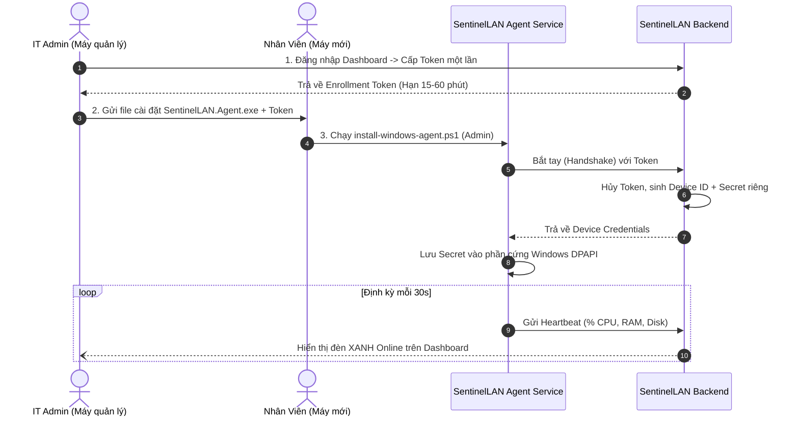

# Hướng Dẫn Chi Tiết Cài Đặt & Kết Nối Agent Trên Máy Nhân Viên

Tài liệu này dành cho Quản trị viên IT (Admin) để thực hiện quy trình cài đặt, ghi danh (Enrollment) và cấu hình Agent trên các máy tính mới của nhân viên.

---

## 1. Tổng quan cơ chế kết nối

SentinelLAN Agent là một **Windows Background Service** siêu nhẹ (dưới 1% CPU, 15MB RAM), sử dụng mô hình kết nối ngược **Outbound Reverse Connection**:
- Máy tính nhân viên **không cần mở bất kỳ port mạng nào**, không cần IP tĩnh.
- Agent chỉ cần gọi một chiều ra ngoài tới Server qua cổng HTTP/HTTPS (`8080` hoặc `443`).
- Dù nhân viên làm việc tại văn phòng (Wi-Fi/LAN), làm việc tại nhà hay quán cà phê, Agent vẫn duy trì kết nối và gửi trạng thái về máy chủ IT an toàn.

---

## 2. Quy trình chuẩn 3 bước



---

## 3. Hướng dẫn từng bước thực hiện

### Bước 1: IT Admin tạo Enrollment Token
1. Đăng nhập vào Dashboard quản trị: `http://<IP-HOAC-DOMAIN-SERVER>:3000` với quyền **Admin**.
2. Trên thanh menu, chọn mục **Thiết bị (Devices)**.
3. Nhìn sang góc phải màn hình, bấm nút **"+ Cấp token enrollment"**.
4. Thiết lập các thông số:
   - **Thời hạn (phút):** Mặc định là `15` phút (có thể chọn tối đa `60` phút).
   - **Lý do:** Điền mục đích cấp token, ví dụ: *"Cấp cho laptop nhân viên mới Nguyễn Văn A"*.
   - Tích chọn ô: *"Tôi xác nhận cấp token và chịu trách nhiệm kiểm toán"*.
5. Bấm **Lưu (Save)**.
6. Màn hình sẽ hiển thị chuỗi Token bí mật. **Hãy sao chép chuỗi này ngay lập tức** vì vì lý do bảo mật, hệ thống chỉ lưu bản băm (hash) và sẽ không hiển thị lại sau khi bạn đóng hộp thoại.

---

### Bước 2: Chuẩn bị bộ cài đặt Agent
Tại máy IT, xuất file chạy Agent độc lập (chỉ cần làm 1 lần):
```powershell
dotnet publish apps/agent/src/SentinelLAN.Agent/SentinelLAN.Agent.csproj -c Release -r win-x64 --self-contained true -p:PublishSingleFile=true -o ./publish/agent
```

Trong thư mục `./publish/agent/`, bạn sẽ có 2 file cần copy sang máy nhân viên:
1. `SentinelLAN.Agent.exe`
2. `install-windows-agent.ps1` (lấy từ thư mục `deploy/agent/`)

---

### Bước 3: Cài đặt trên máy tính nhân viên

1. Copy 2 file trên vào máy tính nhân viên (ví dụ để ở thư mục `C:\Temp` hoặc Desktop).
2. Nhấp chuột phải vào nút Start của Windows -> Chọn **Terminal (Admin)** hoặc **PowerShell (Run as Administrator)**.
3. Di chuyển tới thư mục chứa file và thực thi lệnh cài đặt:

```powershell
.\install-windows-agent.ps1 -ServerUrl "http://192.168.1.100:8080" -EnrollToken "CHUOI_TOKEN_O_BUOC_1"
```
*(Ghi chú: Thay `http://192.168.1.100:8080` bằng địa chỉ IP máy chủ IT hoặc tên miền VPS của bạn).*

**Kết quả hiển thị trên màn hình PowerShell:**
```text
============================================================
    SentinelLAN — Windows Endpoint Agent Installer          
============================================================
[*] Copying SentinelLAN.Agent.exe to C:\Program Files\SentinelLAN\Agent...
[✓] Configured Server URL: http://192.168.1.100:8080
[*] Registering Windows Service: SentinelLANAgent...
[*] Starting SentinelLANAgent...

============================================================
 [✓] SentinelLAN Windows Agent installed & running!         
 Status: Running                                            
============================================================
```

---

### Bước 4: Kiểm tra kết nối trên Dashboard IT & Gán nhân viên

1. Quay trở lại màn hình Dashboard của IT:
   - Danh sách thiết bị sẽ ngay lập tức xuất hiện chiếc máy tính mới với trạng thái **Online** màu xanh lá.
2. Bấm vào tên thiết bị để mở trang **Chi tiết thiết bị (Device Detail)**:
   - Bạn sẽ thấy biểu đồ CPU, RAM, Ổ đĩa thời gian thực đang nhảy số.
3. **Gán thiết bị cho nhân viên:**
   - Kéo xuống phần **Phân công thiết bị (Device assignment)**.
   - Chọn tên nhân viên tương ứng từ danh bạ (ví dụ: `Nguyen Van A - nguyen.a@company.com`).
   - Nhập lý do (ví dụ: *"Bàn giao máy tính làm việc tháng 09/2026"*), tích xác nhận và bấm **Lưu phân công**.
4. Khi nhân viên đăng nhập vào tài khoản của họ tại địa chỉ `http://.../my-device`:
   - Họ sẽ thấy thông tin chính xác máy tính được giao của mình, phiên bản hệ điều hành, chính sách áp dụng và 20 hành động kiểm toán gần nhất của IT.

---

## 4. Xử lý sự cố thường gặp (Troubleshooting)

### Q1: Máy nhân viên chạy script báo "Access Denied"?
* **Khắc phục:** Hãy chắc chắn bạn đã mở PowerShell bằng tùy chọn **"Run as Administrator"**.

### Q2: Script báo thành công nhưng trên Dashboard máy không hiện Online?
* **Khắc phục:**
  1. Kiểm tra tường lửa (Firewall) trên máy chủ IT có đang chặn cổng `8080` hay không.
  2. Mở trình duyệt trên máy nhân viên và gõ thử: `http://192.168.1.100:8080/health/live`. Nếu trả về `{"status":"live"}` là mạng thông suốt.
  3. Kiểm tra xem Token nhập vào có bị hết hạn hay không (nếu hết hạn, hãy vào Dashboard cấp lại Token mới).

### Q3: Muốn gỡ bỏ Agent khỏi máy nhân viên thì làm thế nào?
* Mở PowerShell (Admin) và chạy 3 lệnh sau:
  ```powershell
  Stop-Service -Name SentinelLANAgent -Force
  sc.exe delete SentinelLANAgent
  Remove-Item -Path "C:\Program Files\SentinelLAN" -Recurse -Force
  ```
