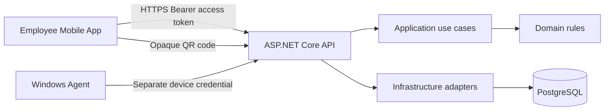

# Kế hoạch ứng dụng mobile cài đặt cho nhân viên SentinelLAN

Trạng thái: Ready for implementation  
Ngày lập: 2026-09-22  
Phạm vi: Ứng dụng native cài được trên Android/iOS, dành cho Employee; tái sử dụng backend SentinelLAN và dữ liệu máy Windows đã được gán  
Ưu tiên phát hành: Android internal APK trước, Android AAB và iOS TestFlight sau  

## 1. Quyết định sản phẩm

Xây dựng một ứng dụng mobile riêng tên làm việc **SentinelLAN Employee** bằng React Native/Expo. Ứng dụng được cài lên điện thoại của nhân viên để:

1. Kích hoạt tài khoản do Admin tạo bằng liên kết dùng một lần.
2. Đăng nhập an toàn vào đúng tổ chức.
3. Quét tem QR trên máy tính được cấp.
4. Xem trạng thái và telemetry kỹ thuật tối thiểu của máy được gán.
5. Xem chính sách, privacy manifest và lịch sử sự cố của chính mình.
6. Báo sự cố, bổ sung mô tả và theo dõi trạng thái xử lý.
7. Đăng xuất và thu hồi phiên mobile.

Ứng dụng mobile **không phải Agent quản trị điện thoại**. Nó không thu thập telemetry của điện thoại, không quản lý Android/iOS, không chạy nền để giám sát và không thay thế Windows Agent. Windows Agent trên máy tính vẫn là nguồn telemetry duy nhất.

## 2. Phạm vi MVP và ngoài phạm vi

### Trong phạm vi

- Android app cài trực tiếp bằng signed APK cho demo nội bộ.
- Android production build dạng AAB để sẵn sàng đưa lên Google Play Internal Testing.
- iOS development/simulator build và TestFlight khi có Apple Developer account.
- Login, refresh session, logout và revoke session.
- Account activation từ universal/app link.
- QR camera scan, nhập mã thủ công và chọn ảnh QR từ thư viện.
- My Device, telemetry, policy, incident, privacy manifest.
- Tiếng Việt/Anh, dark/light theo hệ thống, accessibility cơ bản.
- Hoạt động an toàn khi mất mạng: hiển thị dữ liệu vừa tải trong phiên, không cho gửi trùng mutation.
- Bộ test unit/component/API contract và E2E trên emulator; acceptance test trên điện thoại thật.

### Ngoài phạm vi MVP

- Biến điện thoại thành managed endpoint hoặc MDM.
- GPS, contacts, microphone, call log, SMS, clipboard, danh sách ứng dụng hoặc lịch sử duyệt web.
- Camera nền, quay video, lưu ảnh camera sau khi decode QR.
- Remote desktop, shell, điều khiển máy tính tùy ý hoặc lock/isolation thật.
- Admin/Technician dashboard đầy đủ trên mobile; các vai trò này tiếp tục dùng web.
- Push notification có nội dung nhạy cảm; có thể bổ sung sau bằng payload tối thiểu.
- Biometric được dùng như bằng chứng danh tính. Nếu bổ sung, biometric chỉ mở khóa local token vault, không thay thế xác thực server.

## 3. Giá trị mới, sáng tạo, thực tế và học thuật

### Tính mới phù hợp đồ án

- Một QR vật lý được phân giải theo ngữ cảnh: anonymous chỉ thấy asset card tối thiểu; Employee đã đăng nhập chỉ tới máy được gán cho mình.
- Mobile transparency portal cho phép nhân viên kiểm chứng dữ liệu mà Windows Agent đang thu thập.
- Tách ba danh tính: user mobile, Windows Agent và QR asset label; không dùng credential của loại này thay cho loại khác.
- Mobile session rotation và token-reuse detection được kiểm chứng bằng test concurrent/replay.

### Tính sáng tạo có thể trình bày

- Privacy-first companion app: app nói rõ dữ liệu thu thập và dữ liệu bị cấm ngay tại màn hình My Device.
- Deep link activation an toàn: token được tiêu thụ một lần, không ghi vào log, analytics hay persistent navigation history.
- QR scanner xử lý frame/ảnh cục bộ, chỉ gửi opaque code tới API; không upload ảnh camera.
- Cùng một backend áp dụng tenant, assignment và audit nhất quán cho web, mobile và Agent.

### Tính thực tế

- Android APK có thể cài và demo mà chưa cần tài khoản Google Play.
- Expo/EAS giảm chi phí duy trì hai codebase native nhưng vẫn tạo binary Android/iOS thật.
- Backend modular monolith hiện tại được giữ nguyên; mobile chỉ thêm transport/API contract cần thiết.
- Không yêu cầu mở port vào máy nhân viên. Điện thoại và Windows Agent chỉ kết nối outbound HTTPS.

### Nội dung đánh giá học thuật

- Đo task success của luồng activate -> login -> scan -> My Device -> report incident.
- Đo p50/p95 thời gian QR-to-result trên ít nhất hai thiết bị Android thật.
- Test replay, token rotation, lost-phone logout, malicious deep link, tenant/assignment IDOR.
- So sánh browser PWA và native app theo permission UX, độ ổn định camera, khả năng cài đặt và bảo vệ token.
- Báo cáo giới hạn mẫu thử, cấu hình thiết bị, điều kiện mạng và sai số; không tuyên bố vượt dữ liệu đo được.

## 4. Người dùng và nhu cầu

### Employee

- Kích hoạt tài khoản và đăng nhập bằng organization code, email, password.
- Quét QR nhanh bằng camera sau; chuyển camera khi thiết bị hỗ trợ.
- Chỉ xem máy được gán cho chính mình.
- Xem online/offline, last seen, CPU/RAM/disk, OS/Agent version và policy.
- Xem privacy manifest, lịch sử sự cố và trạng thái xử lý.
- Báo sự cố với title, description, severity và ảnh minh họa tùy chọn ở pha sau.
- Đăng xuất khỏi thiết bị hiện tại hoặc yêu cầu Admin thu hồi toàn bộ phiên.

### Admin/Technician

- Không cần app mobile trong MVP.
- Admin tạo user, cấp invitation, gán máy và QR từ web hiện có.
- Technician xử lý incident/work order từ web.
- Audit phân biệt rõ actor, client type `Mobile`, app version và kết quả; không ghi token, QR raw code hay device fingerprint.

## 5. Hướng giao diện

Phong cách giữ nguyên “calm security operations”: rõ ràng, ít hiệu ứng, tin cậy, không tạo cảm giác theo dõi.

### Điều hướng chính

Sau đăng nhập dùng bottom tabs:

1. **Tổng quan**: máy được gán, trạng thái, last seen, sự cố đang mở.
2. **Quét QR**: camera scanner là tác vụ trung tâm.
3. **Máy của tôi**: thông số kỹ thuật, policy, privacy manifest.
4. **Sự cố**: danh sách, chi tiết, báo sự cố mới.
5. **Tài khoản**: tổ chức, phiên bản app, privacy, đăng xuất.

### Màn hình bắt buộc

- Bootstrap/splash: tải cấu hình công khai, kiểm tra minimum supported version.
- Welcome/login.
- Activate account từ deep link.
- Scan permission rationale, camera, result/error.
- My Device overview và telemetry detail.
- Privacy Manifest.
- Incident list/detail/create.
- Session expired/re-authentication.
- Offline/no-device/not-authorized/update-required.

### Nguyên tắc UX

- Camera chỉ xin quyền sau khi người dùng nhấn “Bật camera”.
- Permission denied phải có hướng dẫn mở Settings và phương án nhập mã/chọn ảnh.
- Không dùng màu làm tín hiệu duy nhất; trạng thái luôn có text và icon.
- Hỗ trợ font scaling, screen reader label, focus order, touch target tối thiểu 44x44 pt.
- Tất cả list dài dùng `FlatList`; route chỉ nhận opaque QR code hoặc enum an toàn, không nhận `deviceId` tùy ý cho Employee.
- Không hiển thị token lâu hơn cần thiết; activation token được xóa khỏi navigation state sau khi đọc.

## 6. Công nghệ và framework

### Mobile

- Expo SDK stable tại thời điểm bắt đầu triển khai; mốc tham chiếu hiện tại là **Expo SDK 57**, React Native 0.86, React 19.2 và New Architecture.
- TypeScript strict và Expo Router.
- `expo-camera` cho camera/barcode scan; chỉ bật barcode scanning, không bật microphone/recording.
- `expo-secure-store` cho opaque refresh token; access token chỉ giữ trong memory.
- `expo-linking`/Expo Router cho custom scheme và verified universal/app links.
- `expo-image-picker` cho người dùng chủ động chọn ảnh QR; không xin quyền đọc toàn bộ thư viện nếu platform cho phép picker scoped.
- TanStack Query quản lý server state; Zod validate response và deep-link params.
- React Hook Form + Zod cho login/activation/incident form.
- `StyleSheet.create` và design tokens dùng chung; không đưa Tailwind DOM styles trực tiếp sang React Native.
- i18n Việt/Anh; không hard-code text rải rác.
- Jest + React Native Testing Library; Maestro cho E2E mobile.

### Build và phân phối

- Expo development build, không dùng Expo Go làm bằng chứng nghiệm thu cuối.
- EAS profiles: `development`, `preview`, `production`.
- Android preview tạo signed APK cài trực tiếp; production tạo AAB.
- iOS simulator/development build, sau đó TestFlight/IPA khi có Apple Developer account.
- Package IDs dự kiến: `com.sentinellan.employee`; development dùng suffix `.dev`.
- Signing key, provisioning profile và store credential nằm trong EAS credential store hoặc secret manager, tuyệt đối không commit.
- OTA update chỉ bật khi có `runtimeVersion`, channel tách biệt và rollback plan; không dùng OTA để vượt review cho thay đổi native/quyền truy cập.

### Backend và contract

- ASP.NET Core/.NET 10 và PostgreSQL hiện tại tiếp tục là nguồn sự thật.
- Application sở hữu use case/session contract; Infrastructure lưu refresh hash và audit; Api chỉ transport/composition.
- OpenAPI là contract gốc; sinh hoặc kiểm tra TypeScript/Zod schemas cho mobile trong CI.
- Không dùng Expo API Routes làm backend nghiệp vụ thứ hai.

## 7. Cấu trúc repository đề xuất

```text
apps/
  mobile/
    src/app/                 # Expo Router routes mỏng
    src/features/auth/
    src/features/scan/
    src/features/my-device/
    src/features/incidents/
    src/features/account/
    src/components/
    src/hooks/
    src/lib/api/
    src/lib/security/
    src/lib/validation/
    assets/
    app.config.ts
    eas.json
packages/
  api-contracts/             # Schema/type dùng chung, không chứa auth storage
  design-tokens/             # Màu, spacing, typography semantic
```

Web và mobile không dùng chung UI component vì React DOM và React Native khác runtime. Chỉ chia sẻ contract, validation thuần TypeScript và design token không phụ thuộc platform.

## 8. Kiến trúc kết nối



Quy tắc:

- Mobile và Agent luôn có credential path riêng.
- Mobile không gọi trực tiếp PostgreSQL, không đọc bảng module khác và không nhận device credential.
- Employee device scope luôn được suy ra từ authenticated actor + assignment server-side.
- Nếu backend chỉ chạy LAN, điện thoại phải cùng LAN hoặc qua VPN được ủy quyền. Production cần hostname HTTPS với certificate hợp lệ; không cho phép bỏ kiểm tra TLS hoặc tin certificate self-signed trong release.

## 9. Xác thực native và quản lý phiên

Cookie HttpOnly hiện tại tiếp tục phục vụ web. Native app cần transport riêng nhưng tái sử dụng cùng `AuthenticationService` và domain rules.

### Endpoint dự kiến

- `POST /api/v1/mobile/auth/login`: organization code, email, password, installation nonce; trả access token ngắn hạn và opaque rotating refresh token đúng một lần.
- `POST /api/v1/mobile/auth/refresh`: rotation bắt buộc; token cũ bị revoke atomically.
- `POST /api/v1/mobile/auth/logout`: revoke session hiện tại.
- `POST /api/v1/mobile/auth/logout-all`: tùy chọn, revoke toàn bộ human refresh sessions của user.
- `GET /api/v1/mobile/bootstrap`: minimum app version, privacy manifest version, feature flags công khai; không chứa secret.

### Quy tắc token

- Access token sống 5–15 phút, chỉ giữ trong memory.
- Refresh token entropy tối thiểu 256 bit, app lưu bằng SecureStore, server chỉ lưu hash.
- Rotation mỗi lần refresh; phát hiện reuse thì revoke cả token family.
- Session chứa user, tenant, role, issued/expiry, family, app version và client type; không tin organization/device ID từ client sau login.
- Không lưu password, access token, activation token hay raw QR trong AsyncStorage, logs, crash report hoặc analytics.
- Khi app vào background, access token có thể giữ memory trong cùng process; sau cold start phải dùng refresh token để lấy access mới.
- Logout xóa SecureStore dù server request thất bại; server session hết hạn/revoke vẫn là lớp kiểm soát cuối.

### Activation deep link

- Custom scheme cho development: `sentinellan://activate?token=...`.
- Production dùng verified HTTPS App Link/Universal Link: `https://<trusted-host>/activate?token=...`.
- Host phục vụ `/.well-known/assetlinks.json` và `apple-app-site-association` đúng signing identity.
- Parse và validate link bằng allow-list scheme/host/path; reject redirect hoặc parameter lạ.
- Token chỉ tồn tại trong memory trong lúc activation, được xóa khỏi router state ngay sau parse và không đưa vào telemetry.

## 10. QR và camera native

- QR chỉ chứa canonical HTTPS URL `/qr/<opaque-code>` hoặc opaque code hợp lệ.
- Entropy/code lifecycle tiếp tục do backend hiện tại quản lý; mobile không tự sinh asset QR.
- `expo-camera` chỉ scan loại QR; callback có debounce/dedup để không gửi nhiều request cùng frame.
- Sau scan, app validate scheme, host, path và code length trước khi gọi API.
- Authenticated Employee gọi resolver hiện có; backend chỉ trả My Device route nếu assignment khớp.
- Ảnh từ camera không lưu vào gallery, không upload, không cache và không log.
- File/image fallback decode cục bộ; URI tạm được giải phóng sau xử lý.
- Camera dừng ngay khi route blur/unmount, scan thành công hoặc app vào background.
- Permission khai báo duy nhất: camera; photo picker dùng quyền scoped. Không khai báo microphone, location hay background camera.

## 11. Dữ liệu local và offline

- Persist duy nhất refresh token trong SecureStore, language/theme và acknowledgement không nhạy cảm.
- TanStack Query cache mặc định chỉ trong memory. MVP không persist telemetry, incident descriptions hoặc asset profile xuống disk.
- Khi offline, hiển thị banner và dữ liệu đang có trong memory kèm timestamp; không giả dữ liệu mới.
- Mutation incident dùng client-generated idempotency key, disable double-submit và retry có giới hạn.
- Không cho queue activation, login, logout-all hoặc QR authorization khi offline.
- Nếu pha sau cần offline cache, phải mã hóa, đặt TTL và có data-erasure test trước khi bật.

## 12. Nội dung cần bảo mật

### Tuyệt mật/không được ghi log

- Password, activation token, access/refresh token.
- QR opaque raw code, enrollment token, device secret.
- Signing keys, Android keystore, iOS certificates/profiles.
- Incident description có thể chứa dữ liệu cá nhân.

### Dữ liệu hạn chế theo tenant/assignment

- Email/display name, assigned device, serial đầy đủ, telemetry, policy, incident và audit đã lọc.
- Mobile app không hiển thị purchase cost, vendor contract, user khác hoặc administrative audit.

### Dữ liệu cấm thu thập

- Vị trí/GPS, microphone, contacts, SMS/call logs, clipboard.
- Ảnh/video nền, ảnh màn hình, keylogging.
- File cá nhân, lịch sử duyệt web, traffic payload, danh sách ứng dụng.
- Device advertising ID hoặc fingerprint dùng theo dõi.

## 13. Threat model mobile

| Mối đe dọa | Kiểm soát | Test bắt buộc |
|---|---|---|
| Mất điện thoại | refresh token SecureStore, server revoke, access TTL ngắn | revoke session rồi API trả 401 |
| Token bị copy/replay | hash-only, rotation, family reuse detection | hai refresh đồng thời chỉ một thành công |
| Malicious deep link | verified link, allow-list host/path, Zod parse | foreign host/scheme bị reject |
| QR độc hại | chỉ QR type, validate origin/path/code, backend RBAC | javascript/file/foreign URL bị reject |
| Cross-tenant/IDOR | actor + assignment server-side, không nhận deviceId | user A không xem máy user B/tenant B |
| App giả gọi API | TLS, signed store build, rate limit; không coi app là trusted | request thiếu/expired token bị reject |
| Secret trong bundle | chỉ public base URL/build metadata trong EXPO_PUBLIC | static scan bundle và repo |
| Screen capture token | không hiển thị refresh/access; activation screen TTL ngắn | screenshot review, UI test không lộ token |
| Root/jailbreak | không dựa vào root detection; server authorization là bắt buộc | rooted client vẫn không vượt RBAC |
| Crash analytics leakage | redaction, no request body/header, opt-in provider | test logger không chứa secrets |
| Stale app | bootstrap minimum version và forced-update screen | version dưới min bị chặn an toàn |

Certificate pinning không nằm trong MVP vì gây rủi ro vận hành khi rotate certificate. Dùng TLS platform trust đúng chuẩn; có thể đánh giá pinning ở pha hardening nếu tổ chức có quy trình rotation và recovery.

## 14. API và backend cần bổ sung

- Mobile auth contracts/endpoints và refresh session metadata `ClientType`, `AppVersion`.
- Refresh rotation/reuse tests dùng cùng invariant với browser session nhưng response transport khác.
- No-store cho login/refresh/bootstrap có dữ liệu session.
- Rate limit riêng cho mobile login, activation, refresh và QR resolve.
- Audit events: `MobileLoginSucceeded/Failed`, `MobileSessionRefreshed`, `MobileLogout`, `MobileQrScanned`, `EmployeeIncidentReported`; không ghi raw token/code.
- CORS không phải cơ chế bảo vệ native app; mọi endpoint vẫn bắt buộc auth/RBAC/tenant.
- Existing `/my-device`, `/my-device/telemetry`, `/my-device/incidents`, `/qr/{code}` được tái sử dụng sau khi contract tests xác nhận.
- OpenAPI cập nhật security scheme Bearer cho mobile và Cookie cho browser.
- Không tạo bảng mobile device inventory nếu không có nhu cầu quản trị thực; chỉ session metadata tối thiểu.

## 15. Các pha thực hiện

### Pha 0 — ADR, baseline và prototype (2–3 ngày)

- Ghi ADR chọn Expo/React Native và tách mobile session khỏi browser cookie.
- Chốt Android-first, application ID, API host và môi trường dev/staging.
- Prototype development build: login shell, camera permission và gọi health endpoint.
- Kiểm tra ít nhất một Android thật trước khi phát triển sâu.

### Pha 1 — Backend mobile auth (4–6 ngày)

- Contract/test trước cho login, refresh rotation, concurrent reuse, logout và revoke.
- Application service tái sử dụng validation/password/tenant rules hiện có.
- Infrastructure persistence/migration mới nếu session metadata cần schema.
- API endpoints, rate limit, no-store, audit và OpenAPI.

### Pha 2 — Mobile foundation (3–5 ngày)

- Tạo `apps/mobile`, Expo Router, TypeScript strict, config theo EAS profile.
- API client, Zod schemas, QueryClient, SecureStore adapter, auth state machine.
- Design tokens, i18n, error boundary, loading/empty/offline states.
- Login/logout/session refresh và protected route guard.

### Pha 3 — Activation và deep link (2–4 ngày)

- Custom scheme cho dev; verified App/Universal Links cho staging/prod.
- Activate screen, token-in-memory, remove params, double-submit guard.
- Test expired/revoked/replayed link và link từ host lạ.

### Pha 4 — QR scanner (3–5 ngày)

- Permission rationale, camera lifecycle, QR-only scan, debounce.
- Resolve theo authenticated role/assignment.
- Manual code và image picker fallback.
- Test permission denied, malicious URL, duplicate frame, revoke/rotate.

### Pha 5 — My Device và Incident (4–6 ngày)

- Overview, telemetry, policy, privacy manifest.
- Incident list/detail/create với idempotency key.
- Pull-to-refresh, empty/error/offline states và accessibility.
- Không thêm administrative action cho Employee.

### Pha 6 — Build, hardening và phát hành thử (4–7 ngày)

- Android preview APK và test cài mới/nâng cấp/gỡ cài đặt.
- Android AAB Internal Testing.
- iOS simulator/TestFlight khi có tài khoản và máy build phù hợp.
- Dependency audit, secret scan, bundle inspection, performance/accessibility test.
- Cập nhật architecture, data flow, threat model, use case, demo script và release checklist.

Tổng ước lượng một người: 4–6 tuần cho Android MVP có chất lượng đồ án; thêm 1–2 tuần cho iOS parity, store metadata và review fixes.

## 16. Test matrix

### Unit/component

- Zod reject response/deep-link sai schema.
- Auth state machine: cold start, refresh, expiry, logout, lost network.
- SecureStore adapter không fallback sang AsyncStorage cho secret.
- Scanner debounce, permission denied, camera cleanup.
- My Device loading/error/empty/success và no-assignment.
- Incident double-submit/idempotency.

### Backend integration

- Pending/locked user không login mobile.
- Login tenant sai trả generic error.
- Refresh token hash-only, expiry, rotation, replay và concurrent requests.
- Logout/revoke có hiệu lực ngay với refresh; access hết hiệu lực theo TTL/revocation policy.
- Employee chỉ xem máy được gán và incident của chính mình.
- QR public/authenticated không lộ PII và đúng assignment.
- Audit không chứa password/token/raw QR.

### Mobile E2E

1. Mở activation link -> đặt password -> login.
2. Login sai -> generic error; login đúng -> tabs Employee.
3. Scan QR máy được gán -> My Device.
4. Scan QR máy khác -> forbidden không lộ thông tin.
5. Deny camera -> manual/image fallback.
6. Report incident -> xuất hiện trong list, không tạo trùng.
7. App cold start -> refresh session an toàn.
8. Admin revoke session -> app quay về login.
9. Offline -> banner rõ ràng, không giả dữ liệu/mutation thành công.
10. QR bị rotate/revoke -> mã cũ thất bại.

### Thiết bị nghiệm thu tối thiểu

- Một Android tầm trung hiện hành và một Android cấu hình thấp hơn.
- Android emulator trong CI.
- iPhone simulator; một iPhone thật trước TestFlight nếu iOS thuộc phạm vi bàn giao.
- Camera thật, mạng LAN, Wi-Fi yếu và chuyển Wi-Fi/4G.

## 17. CI/CD và quality gates

- `npm ci` ở workspace root.
- Mobile lint, TypeScript strict, Jest/RNTL và Expo Doctor.
- OpenAPI contract drift check.
- Android development/preview build; production build chỉ từ protected branch/tag.
- Maestro smoke E2E trên emulator.
- `npm audit`, secret scan và license review.
- Backend restore/build/test Release và vulnerability check.
- EAS secrets/credentials kiểm tra bằng metadata, không in giá trị.
- Artifact retention giới hạn; APK nội bộ không public.

## 18. Kịch bản demo đồ án

1. Admin trên web tạo Employee và lấy activation link một lần.
2. Mở link trên điện thoại; app được route tới Activate.
3. Employee đặt password, login và thấy trạng thái “chưa có máy”.
4. Admin enroll Windows Agent, gán máy và phát hành QR opaque.
5. Employee mở app, cấp quyền camera và quét QR thật.
6. App mở My Device, hiển thị telemetry mới nhất và privacy manifest.
7. Employee báo sự cố; Technician thấy incident trên web.
8. Admin rotate QR; mobile chứng minh QR cũ không còn dùng được.
9. Admin revoke mobile session; app bị yêu cầu login lại.
10. Trình bày database chỉ lưu token/QR hash và audit append-only.

## 19. Tiêu chí nghiệm thu

- APK ký số cài được trên Android thật và không phụ thuộc Expo Go.
- App login/refresh/logout qua HTTPS, secret chỉ ở SecureStore/server hash.
- Activation token dùng đúng một lần; replay/concurrent request bị chặn.
- QR camera thật hoạt động; manual/image fallback hoạt động.
- Employee không thể truy cập máy/user/tenant khác bằng sửa deep link hoặc request.
- My Device và incident dùng API thật, không dùng mock/demo fallback trong production.
- Camera dừng khi rời màn hình; không có quyền microphone/location/background.
- 100% security-critical backend tests pass; mobile unit/component/E2E critical path pass.
- Android accessibility smoke test và test trên ít nhất hai máy thật được ghi vào báo cáo.
- Tài liệu architecture, OpenAPI, threat model, privacy disclosure và store data-safety form đồng bộ.

## 20. Definition of Done

- Có `apps/mobile` với cấu trúc rõ ràng và dependency được pin/audit.
- Có ADR mobile architecture và mobile authentication.
- Có build installable Android APK/AAB; iOS artifact nếu thuộc mốc bàn giao.
- Không commit signing credentials, token, certificate, `.env`, APK/IPA/AAB hoặc log.
- Không có telemetry điện thoại hoặc permission ngoài phạm vi.
- Backend/mobile contract được kiểm tra tự động.
- Demo end-to-end chạy trên điện thoại thật và Windows Agent thật.
- Báo cáo cuối phân biệt rõ tính năng thật, mock/simulated và phần chưa phát hành store.

## 21. Điều kiện cần trước khi bắt đầu code

- Chốt hostname HTTPS staging mà điện thoại truy cập được.
- Chốt Android application ID và iOS bundle ID.
- Có Android test device; iOS cần macOS hoặc EAS Build và Apple Developer account.
- Chốt phương thức phát hành: internal APK, Play Internal Testing, TestFlight hay cả ba.
- Chốt privacy policy URL và đầu mối hỗ trợ IT.
- Chốt liệu incident có cho phép đính kèm ảnh; mặc định MVP chưa bật để giảm rủi ro dữ liệu cá nhân.

## 22. Tài liệu kỹ thuật tham chiếu

- Expo SDK latest: https://docs.expo.dev/versions/latest/
- Expo Camera: https://docs.expo.dev/versions/latest/sdk/camera/
- Expo secure storage: https://docs.expo.dev/develop/user-interface/store-data/
- EAS Build setup: https://docs.expo.dev/build/setup/
- React Native New Architecture: https://reactnative.dev/architecture/landing-page
